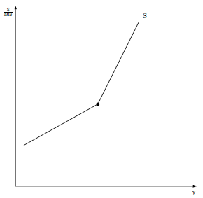
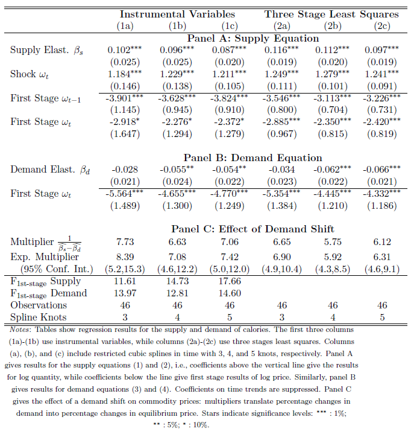

```{r setup, include=FALSE}
knitr::opts_chunk$set(echo=FALSE, fig.pos='htbp', fig.align = 'center', warning = FALSE, message = FALSE)

#Load some packages
if (!require("pacman")) install.packages("pacman")
pacman::p_load(magrittr)
pacman::p_load(tidyverse)
pacman::p_load(viridis)
pacman::p_load(Cairo)

#Basic setup for figures
source("Figures/Graph parameters.r")

```

\setcounter{chapter}{1}
\setcounter{page}{37}

# Supply

In this section we will begin by studying models of production. Second, we will use duality to describe production technology in models where prices as dependent variables. Third, we will look into how to estimate supply response models. Finally, we will study the competitive storage model and livestock supply model.

Useful references for the material in this chapter are @Chambers1988 and @Beattie2009. The chapter by @Mundlack2001 in the Handbook of Agricultural Economics also gives a good review but is quite difficult to read. You can also check @Fuss1978 and @McFadden1978. These are older texts but are available for free online. @Henningsen2018 is a good reference about applied work in production analysis. For the material about the competitive storage model, @MirandaFackler2002 is a great reference to learn how to solve the model using collocation.

## Primal estimation of production

The objective in estimating a production function is quite obviously to describe production technology in function that explains how inputs combine to produce one or many outputs, how inputs substitute or complement each other and verify whether there are economies or scale or scope.

Why estimate a production function? Reasons include:

- Test theory that $p \frac{\p f(\mathbf{x})}{\p x_i} = w_i$;
- Examining the contribution of factors of production;
- Testing for technical change;
- Obtaining estimates of:
    - Production elasticities;
    - Returns to scales;
    - The effect of input quality on production;
    - The effect of management;
    - Technical efficiency.

The direct estimation of production functions is not very common anymore as the dual approach has mostly taken over. There are nonetheless some cases where estimating a production is a sensible approach, provided that the use of a proper method. At first glance, estimating a production function seems simple as a linear regression of the log of output on the log of inputs may appear to perform well. We will see that there are a number of important problems with that approach.

### General issues

To help identify the issues regarding the estimation of production function, we will take a look in this section at two papers from great economists. You can also find a survey of these issues in @Mundlack2001.

#### @Schultz1956

Theodore W. Schultz is maybe the most recognized agricultural economist of the 20th century. A former member and Chair of the department of economics at Iowa State University, Schultz received the Nobel Memorial Prize in Economics in 1979 as a member of the department of economics at the University of Chicago.\footnote{Schultz left the department of economics at Iowa State University following a dispute on academic freedom.}

@Schultz1956 is interested in explaining long-run growth in agricultural output: ``Growth in output cannot be explained by an analysis which is based in conventional inputs.'' The following summarizes the main points.

@Schultz1956 make several interesting observations regarding why it is more difficult to estimate supply than demand. The first is that we know a lot more about demand than supply. Estimating elasticities of demand is relatively easy. Simple estimates of demand elasticities (e.g. log-log model) in general yield estimates close to estimates from models consistent with economic theory (e.g. AIDS). Much less is known on the supply side. For example, there were no meaningful estimates of elasticity of supply at the time of Schultz wrote more than 50 years ago, and this might still be true today. One issue is that supply elasticities depend on the length of run. @Schultz1956 also raised the issue that estimating a production function will not work because it is based on conventional inputs. Over time, the quality of inputs changes. For example, it is easy to imagine how machinery can improve in quality in a 10-year period. Think for example of the introduction of computers and GPS recently. Another issue in estimating a production function is that for estimates of a production function to be useful, it must either be stable or change in a predictable way. Tastes do not change over time. However, on the production side, innovations are unpredictable which makes the production technology unpredictable as well.

@Schultz1956 summarizes the issues by noting that demand rests on a stable foundation while supply stands on *shifting sand*. The two main reasons are:

- Tastes are constant while production technology and input quality change;
- Economies of size, scale and the free entry of firms.

These two points imply that estimating a production function requires including dynamic and modeling the competitive environment where firms operate.

@Schultz1956 claims that an analysis based on conventional inputs does not have predictive power. Table \ref{tab.Schultz} shows table 1 in @Schultz1956. Observe that there is little consistency between the growth in output and the growth in input. Additional inputs account for less than one-fifth of the growth in output (1870-1950). Given the disconnection between the change in output and the change in inputs, measuring productivity growth is a measure of our ignorance [@Abramovitz1956].

```{r, echo=FALSE, fig.cap = "Changes in Output and Input in Agriculture in the United States: table 1 in Schultz (1956) \\label{tab.Schultz}", out.width = '75%'}

```

@Schultz1956 offers possible explanations:

i. Greater division of labor (specialization);
ii. Improvement in the quality of people (knowledge/education);
iii. Inventions (new technology);
iv. Scale economies (either pre-existing or due to i., ii. or iii.).

The first explanation suggests that the production function is not stable. The second and third explanations, together, suggest that some inputs are neglected in conventional analysis of production. @Schultz1956 did not try to explain the importance of these factors in output growth.

For @Schultz1956, a strong and satisfying linkage between input and output is one where the ratio of output and input equals one:
$$\frac{\text{Output}}{\text{Input}} =1,$$
where the measure of input can be thought as an index that includes change in quality. The closer the ratio is to one, the more complete is the explanation of production. The measure of input must consider neglected inputs that are new technologies and improvements in labor force.

Overall, inputs account for a variable and declining fraction of additional outputs. @Schultz1956 did not attempt to explain output growth but suggested that human capital and new technologies are the main drivers.

#### @Griliches1963

Zvi Griliches was a student a T. Schultz and made important contributions in the economics to technology adoption, R\&D, patents and econometrics.

A typical production function can be represented as
$$y_t = g(\mathbf{x}_t, u_t, T_t),$$
where $y_t$ is an index of physical output, $\mathbf{x}_t$ is a set of *measurable* inputs, $u_t$ is a random variable, $T_t$ is the *level of technology*, often approximated by a trend variable. For @Griliches1963, this approach is not fruitful and therefore not useful if it is not a stable function because there remains large unexplained shifts. A measure of technical change from the coefficient for the trend variable is a measure of our ignorance. @Griliches1963 proposes to attribute growth in output to changes in quantities and qualities of inputs and to economies of scale.

For @Griliches1963, the main sources of growth that are unexplained by conventional analysis are:

i. Improvement in quality of labor;
ii. Improvement in quality of machinery;
iii. Wrong factor weights - underestimation of the contribution of capital and overestimation of the contribution of labor;
iv.  Economies of scale.

The third source of growth denies equilibrium assumptions that $w_K < MVP_K$ and $w_L > MVP_L$, where $MVP$ is marginal value product. These inequalities imply a flow of capital toward agriculture and a flow of labor outside of agriculture.

Measured productivity growth is therefore a specification or measurement error. @Griliches1963 suggests to include new variables in the estimation of production functions that include:

- R\&D capital;
- Education;
- Government and private sector research and extension work;
- Infrastructure.

These variables account for knowledge and quality of inputs.

@Griliches1963 shows the importance of including those variables in a production function by estimating a production function using 1949 data for sixty-eight regions of the United States. The model is a Cobb-Douglas production function
\begin{align*}
\ln{(\text{Value of production})} &= \beta_1 \ln{(\text{Livestock expense})}\\
&+ \beta_2 \ln{(\text{Other expense})} + \beta_3 \ln{(\text{Machinery})} \\
&+ \beta_4 \ln{(\text{Land})} + \beta_5 \ln{(\text{Buildings})} + \beta_6 \ln{(\text{Man-years})} \\
&+ \beta_7 \ln{(\text{Education})} + u_t.
\end{align*}
Table \ref{tab.Griliches2} shows the results obtained by @Griliches1963. The two rows in the table shows the outcomes of two regressions. The columns represent regressors. Observe that the coefficient are very different when the variable for education is included and note that the coefficient for education is very significant.

```{r, echo=FALSE, fig.cap = "Aggregate agricultural production function: table 1 in Griliches (1963) \\label{tab.Griliches2}", out.width = '75%'}

```

### The Cobb-Douglas model of production

The Cobb-Douglas is a functional form that is commonly used when estimating a production function. @Mundlack2001 offers a good summary of what he calls the *Cobb-Douglas culture*.

The Cobb-Douglas production function for the case of two inputs is simply
$$y_t = A(t) x_{1t}^{\beta_1} x_{2t}^{\beta_2} e^{u_t},$$
where $A(t)$ can vary with time to capture *technical change*. The Cobb-Douglas production function is usually estimated in log-linear form
$$\ln{y_t} = \ln{A(t)} + \beta_1 \ln{x_{1t}} + \beta_2 \ln{x_{2t}} + u_t.$$
There are several advantages of estimating a Cobb-Douglas production function. First, it is easy to implement as it only requires estimating a linear model. Second, it does not require much data as observations for output quantity and input quantities are sufficient. Third, it allows for the measurement of return to scale. For example, in the two-input example above, we observe increasing return to scale if $\beta_1 + \beta_2 >1$. Fourth, the Cobb-Douglas allows to verify whether  $w_L = MVP_L$. Finally, the Cobb-Douglas model does not assume perfect competition.

Many reasons explain why the Cobb-Douglas model of production, or other primal models of production, are not often used. In the case of the Cobb-Douglas model, it imposes unitary elasticities of substitution. The model also assumes that input quantities are exogenous, which is incorrect, causing OLS estimates to be inconsistent. @Mundlack2001 suggests using covariance analysis with panel data to correct the bias from endogeneity. It is also possible to use prices, which are exogenous, as instruments. It is difficult to estimate a model of production with micro data (cross section) because there is not much variation in prices and therefore little variation in input ratios. There are also aggregation problems with the Cobb-Douglas production function. Estimates that assume Cobb-Douglas technology lack robustness across studies. One difficulty is how to handle capital. Should capital be included as a stock or a flow (buildings and tractors are not used all year long)? Finally, one important shortcoming of the Cobb-Douglas model is how to handle multiple outputs. For instance, in agriculture, most farms produce more than one output. In Iowa, it is common for farms to produce corn and soybeans.

There might be no endogeneity problem in the primal model of production if production is not deterministic and producers know about the stochastic nature of production. If production is indeed not deterministic, then it is possible that inputs are not determined simultaneously with the output [@Zellner1966; @Henderson2015].

For the reasons described above, the primal model of production has fallen out of favor. Economists now rely most often on the duality of production in their empirical approach.

Note that there are many functional forms other than the Cobb Douglas to model production. An adaptation of the translog model that we saw in the chapter on demand can be used to estimate a production function. Flexible functional forms, that we will cover later in this chapter, are less restrictive and allow to consider multiple outputs.

### Technical efficiency

<!-- I should explain this better and define a distance function using a flexible functional form and show how to move an input price on the left hand side. This only provides intuition and not much methodology-->

One motive for estimating a production function is to measure the efficiency of firms. If firms are not efficient, it means that they are not using resources in an optimal manner, implying an allocation of resources that is not Pareto optimal. Inefficiency may be caused by technical change as firms do not adopt new, better, technology all at the same time.

*Technical efficiency* measures the ability of firms in combining inputs to produce a maximum output [@Koopmans1951]. It can be measured as the ratio between the observed output and the maximum output under the assumption of fixed input. Alternatively, technical efficiency is measured as the ratio between the observed input and the minimum output under the assumption of fixed output.

This section focuses on technical efficiency. We will ignore *allocative efficiency*, which is the combination of inputs and outputs in optimal proportions given prevailing prices, and is better estimated using a cost function [see @KoppDiewert1982].

To look at measures of technical efficiency, we must first define the production technology. Consider that production involves $m$ outputs $\mathbf{y}=(y_1, y_2,..., y_m) \in \Re_{+}^m$ and $n$ inputs $\mathbf{x}=(x_1, x_2,..., x_m) \in \Re_{+}^m$. We can summarize outputs and inputs through a netput vector $\mathbf{z} \equiv (-\mathbf{x}, \mathbf{y})$. The production technology is given by the feasible set $F$, such that $\mathbf{z} = (-\mathbf{x}, \mathbf{y}) \in F$, where we will assume that $F$ is closed.

Measuring technical efficiency requires defining a metric that captures the efficiency of firms in combining inputs. To this end, define
$$ Eff(-\mathbf{x}, \mathbf{y}) \equiv \{(-\mathbf{x}, \mathbf{y}), (-\mathbf{x}, \mathbf{y}) \in F, (-\mathbf{x'}, \mathbf{y}) \notin F, \forall \mathbf{x'} \leq \mathbf{x} \}$$ 
as the efficient production. This is the frontier of the production set.

#### Shephard's input distance function

@Shephard1953 defines the input distance function as
\begin{align*}
D_I^S(-\mathbf{x}, \mathbf{y}) &= \max_{\alpha} \{ \alpha:(-\frac{\mathbf{x}}{\alpha}, \mathbf{y}) \in F \} \text{ if } (-\frac{\mathbf{x}}{\alpha}, \mathbf{y}) \in F \text{ is feasible}\\
            &= -\infty \text{ otherwise.}
\end{align*}
For $D_I^S(-\mathbf{x}, \mathbf{y})>1$, a firm is inefficient as it is possible to scale down its inputs and produce the same output given the existing technology. Letting $D_I^S(-\mathbf{x}, \mathbf{y}) = 1$ provides the multi-input, multi-output production frontier.

#### Farrell's input distance function

@Farrell1957 defines the input distance function as
\begin{align*}
D_I^F(-\mathbf{x}, \mathbf{y}) &= \min_{\beta} \{\beta:(-\beta \mathbf{x}, \mathbf{y}) \in F \} \text{ if } (-\beta \mathbf{x}, \mathbf{y}) \in F \text{ is feasible}\\
            &= \infty \text{ otherwise.}
\end{align*}
Observe that Farrell's input distance function is the inverse of Shephard's input distance function. Thus, for $D_I^F(-\mathbf{x}, \mathbf{y})<1$, a firm is inefficient as it is possible to scale down its inputs and produce the same output given the existing technology. Letting $D_I^F(-\mathbf{x}, \mathbf{y}) = 1$ provides the multi-input, multi-output production frontier.

#### Shephard's output distance function

@Shephard1953 defines the output distance function as
\begin{align*}
D_O^S(-\mathbf{x}, \mathbf{y}) &= \min_{\theta} \{\theta:(-\mathbf{x}, \frac{\mathbf{y}}{\theta}) \in F \} \text{ if } (-\mathbf{x}, \frac{\mathbf{y}}{\theta}) \in F \text{ is feasible}\\
            &= -\infty \text{ otherwise.}
\end{align*}
For $D_O^S(-\mathbf{x}, \mathbf{y})<1$, a firm is inefficient as it is possible to increase its outputs with the same inputs given the existing technology. Letting $D_O^S(-\mathbf{x}, \mathbf{y}) = 1$ provides the multi-input, multi-output production frontier.

#### Econometric approach to measure efficiency

Measuring efficiency requires an empirical description of technology. This section covers, very briefly, the basic parametric estimation of technical efficiency using a production function. It is possible to preform similar analysis using a cost function. I do not discuss non-parametric methods such as Data Envelopment Analysis which is based on linear programming.

Write a Cobb-Douglas production function for a single output and $n$ inputs as
$$ y = \alpha \prod_i^n \left(\frac{x_i}{\upsilon}\right)^{\beta_i},$$
where $\upsilon$ is a measure of technical efficiency as defined by Shephard's input distance function. Taking logs, and writing the production function as an empirical model for a cross-section of firms yields
\begin{equation}\label{eq:log_eff}
\ln y_j = \ln \alpha + \Sigma_i^n \beta_i \ln x_{ij} + u_j + e_j,
\end{equation}
where the subscript $j$ identifies a firm and $u_j = - \ln \upsilon_j$ when assuming constant return to scale, and $e_j$ is an error term. In \eqref{eq:log_eff}, the error term has two components: the stochastic term $e_j$ captures random shocks while the systematic component $u_j \le 0$ measures firm efficiency. Identification of $u_j$ is difficult with cross-section data but possible when making distributional assumptions for the two error terms.

A panel of firms helps in identifying efficiency parameters. Rewrite the empirical model for the production function, assuming constant return to scale, for a panel of firms as
$$\ln y_{jt}  = \ln \alpha  + \Sigma_i^n \beta_i \ln x_{ijt} + u_j + e_{jt},$$
where $t$ identifies time. Observe now that the stochastic term $e_{jt}$ varies over producers and time while the parameter $u_j$ for technical efficiency varies only over producers. It is thus possible to estimate $u_j$ using a fixed effect or a random effect model. It is then possible to compare firms' efficiency by comparing their values for $u_j$. For an example of such approach, see @Battese1992. This approach however may not guarantee that the distributional assumptions on $u_j$ are met.

In some applications, measuring efficiency is not sufficient and someone might want to explain efficiency. This can be done by specifying a functional form for $u_j$ and explain technical efficiency simultaneously with production technology by writing
$$u_j = g(\mathbf{z_j}: \mathbf{\delta}),$$
where $\mathbf{z_j} \neq \mathbf{x_j}$ is a vector of explanatory variables for efficiency. It is common to assume that $u_j$ either follows a truncated normal distribution or a half-normal distribution. You can find an example of this type of model in @coelli1996.^[Tim Coelli makes available a software called Frontier 4.1 to estimate production frontier using maximum likelihood (<http://www.uq.edu.au/economics/cepa/frontier.php>). An implementation of the software is available through the package Frontier in R (<http://cran.r-project.org/web/packages/frontier/index.html>).] An alternative is to do this in two stages and regress $\hat{u_j}$ on a vector of explanatory variables.

The estimation of technical efficiency is not limited to the Cobb-Douglas model. Many other models of production can be used, including the translog production function and non-parametric econometric models. If you wish to learn more about technical efficiency, I suggest that you look at the work by William Greene and the material on his webpage (<http://people.stern.nyu.edu/wgreene/>).

Endogeneity is a possible problem when estimating a production frontier. There are however several approaches for dealing with the endogeneity problem. See for example @GuanKumbhakarMyersEtAl2009, @SheeStefanou2014, @AmslerProkhorovSchmidt2016 or @Latruffe2017.

## Dual estimation of production

In the dual estimation of production, technology is summarized in equations for profits, costs or revenue. We will cover the estimation of a cost function. The estimation techniques are similar for profit functions and revenue functions.

There are several reasons for duality in estimating production technology. Duality of production implies that prices appear on the right hand side rather than quantities. For competitive firms, prices are exogenous and therefore there should be no endogeneity problem using the dual approach. Duality also allows to consider multiple outputs.

Perfect competition is a maintained assumption in what we will cover. See @Paul2001 or @Paul2001a for examples of estimation of cost functions under imperfect competition.

### Desirable restrictions from the theory of production

Consider a representative firm that minimizes its cost to produce a given output $y$. This example applies to a firm that produces a single output but can easily be generalized to multi-output production. A firm minimizes its cost by choosing a set of inputs such that the cost function for a single output firm is given by
$$ C(\mathbf{w},y)=\min_{\mathbf{x}} \mathbf{w} \cdot \mathbf{x} \text{ s.t. } f(\mathbf{x}) \ge y,$$
where $\mathbf{x}$ is a vector of inputs,  $\mathbf{w}$ is a vector of input prices, $f(\mathbf{x})$ is the production function and $y$ is the output.

When estimating a cost function, we will impose or test properties derive from the theory of production.

Properties:

i. Increasing in $\mathbf{w}$;
ii. Homogeneous of degree one in $\mathbf{w}$;
iii. Concave in $\mathbf{w}$;
iv. Strictly increasing in $y$.
v. Convex in $y$.

Using Shephard's lemma yields the input demand equations
\begin{equation}\label{eq.prod.Shephard}
\frac{\p C(\mathbf{w},y)}{\p w_i} = x_i(\mathbf{w},y).
\end{equation}

### Flexible functional forms

We will look at how to estimate cost functions using flexible functional forms. We used flexible function forms in the section about the translog model of demand. Before covering models of cost function, lets define in more details what is the meaning of a flexible functional form.

The concept of functional form that we will consider was introduced by @Diewert1971 and @Diewert1976. There are other definitions of flexibility. For instance, @Gallant1984 introduce locally flexible functional forms using Fourier expansions while @Diewert1987 define globally flexible function forms.

A functional form is flexible if it has enough parameters to approximate a twice continuously differentiable function. A flexible function $f(\mathbf{x})$ of $m$ variables has enough free parameters to satisfy the following $m^2+m+1$ equations
\begin{align*}
& f(\mathbf{x}) \rightarrow 1;\\
& \bigtriangledown f(\mathbf{x}) \rightarrow m;\\
& \bigtriangledown^2 f(\mathbf{x}) \rightarrow m^2.
\end{align*}
A flexible function form does not require $m^2+m+1$ parameters to satisfy these $m^2+m+1$ equations. By Young's theorem, $\bigtriangledown^2 f(\mathbf{x})$ is symmetric and therefore contains $\frac{m(m+1)}{2}$ equations (try to verify this). Thus, for a functional form to be called flexible, it needs only to satisfy one equation for the value function, $m$ equations for the Jacobian and $\frac{m(m+1)}{2}$ equations for the Hessian for a total of $\frac{(m+1)(m+2)}{2}$ free parameters.

Note that flexible functional forms do not have the ability to closely approximate arbitrary technology. Parametric estimation of production technology always requires the specification of some functional form that has its own limitations. The advantage of flexible functional forms is not in their capacity to truly approximate technology but in their capacity to place fewer restrictions on technology.

### Examples of flexible cost functions

We will see examples of functional forms that are linear in parameters. In particular we will look at functions of the \emph{general linear form}
$$ f(\mathbf{z}) = \sum_{i=1}^N \alpha_i b_i(\mathbf{z}),$$
where $\alpha_i$ is a parameter and $b_i(\mathbf{x})$ is a twice-continuously differentiable function. Mores specifically, we will consider \emph{generalized quadratic} functional forms
$$ f(\mathbf{z}) = \beta_0 + \sum_{i=1}^N \beta_i g_i(z_i) + \frac{1}{2} \sum_{i=1}^N \sum_{j=1}^N \beta_{ij} g_i(z_i) g_j(z_j),$$
where $\beta_{ij,} = \beta_{ji}$ and each $g_i(z_i)$ is a twice-continuously differentiable function. The difference between a general linear form and a generalized quadratic is that the generalized quadratic imposes more parametric restrictions.

#### Normalized quadratic cost function

The normalized quadratic cost function was introduced by @Diewert1987 but was called the *Symmetric Generalized McFadden* functional form.^[@Lau1976 introduced the normalized quadratic profit function.] The quadratic cost function with $N$ inputs, $M$ outputs and a time trend is given by
\begin{align*}%\label{eq.quad}
C^Q(\mathbf{W},\mathbf{Y},T) &= \alpha_0 + \sum_{i=1}^N \beta_i W_i + \sum_{k=1}^M \delta_k Y_k + \tau_T T \notag \\
                       &+ \frac{1}{2} \left( \sum_{i=1}^N \sum_{i=1}^N \beta_{ij} W_i W_j +  \sum_{k=1}^M \sum_{l=1}^M \delta_{kl} Y_l Y_k + 2 \tau_{TT} T^2 \right) \\
                       &+ \frac{1}{2} \left(
                         \begin{array}{l}
                         \sum_{i=1}^N \sum_{k=1}^M \gamma_{ik} W_i Y_k + \sum_{i=1}^N \rho_{iT} W_i T + \sum_{k=1}^M \pi_{kT} Y_k T \\
                        + \sum_{k=1}^M \sum_{i=1}^N \gamma_{ki} Y_k W_i + \sum_{i=1}^N \rho_{Ti} T W_i + \sum_{k=1}^M \pi_{Tk} T Y_k
                       \end{array}
                       \right),\notag
\end{align*}
where $W_i$ is the price of input $i$, $Y_k$ is the quantity of output $k$ and $T$ indicates time. You can verify that
\begin{align*}
& \bigtriangledown C^Q(\mathbf{W},\mathbf{Y},T) \rightarrow n+m+1 \text{ equations};\\
& \bigtriangledown^2 C^Q(\mathbf{W},\mathbf{Y},T) \rightarrow (n+m+1)^2 \text{ equations}.
\end{align*}
We can impose symmetry by letting $\beta_{ik}=\beta_{ki}$, $\delta_{ik}=\delta_{ki}$, $\gamma_{ik}=\gamma_{ki}$, $\rho_{iT}=\rho_{Ti}$ and $\pi_{Tk}=\pi_{kT}$:^[It is possible write the expression in \eqref{eq.quadnorm} more compactly. I write the cost function this way is because it is easier to show and impose parametric restrictions.]
\begin{align}\label{eq.quadnorm}
C^Q(\mathbf{W},\mathbf{Y},T) &= \alpha_0 + \sum_{i=1}^N \beta_i W_i + \sum_{k=1}^M \delta_k Y_k + \tau_T T + \frac{1}{2} \sum_{i=1}^N \beta_{ii} W_i^2  \notag \\
                       &+ \sum_{i=1}^N \sum_{j=i+1}^N \beta_{ij} W_i W_j +  \frac{1}{2} \sum_{k=1}^M \delta_{kk} Y_k^2 + \sum_{k=1}^M \sum_{l=k+1}^M \delta_{kl} Y_l Y_k + \tau_{TT} T^2 \\
                       &+ \sum_{i=1}^N \sum_{k=1}^M \gamma_{ik} W_i Y_k + \sum_{i=1}^N \rho_{iT} W_i T + \sum_{k=1}^M \pi_{kT} Y_k T.\notag
\end{align}
Symmetry of the Hessian means that we can reduce the number of equations from $(n+m+1)^2$ to $\frac{(n+m+1)(n+m+2)}{2}$. Thus, for the quadratic cost function to be flexible, it must have a total of $\frac{(n+m+2)(n+m+3)}{2}$ free parameters, which it does.

Recall that the cost function is homogeneous of degree one, i.e. $\lambda C^Q(\mathbf{W},\mathbf{Y},T) = C^Q(\lambda \mathbf{W},\mathbf{Y},T)$. We can impose homogeneity by dividing, that is normalizing, the cost and the input prices by one input price that represents a numeraire. Thus, using input 1 as numeraire, we can write that the \emph{normalized} cost function is
\begin{align*}
\tilde{C^Q}(\mathbf{W},\mathbf{Y},T) &= \alpha_0 + \beta_1 + \sum_{j=2}^N \beta_i \tilde{W}_i + \sum_{k=1}^M \delta_k Y_k + \tau_T T + \frac{1}{2} \beta_{11} + \frac{1}{2} \sum_{i=2}^N \beta_{ii} \tilde{W}_i^2\\
                       & + \sum_{j=2}^N \beta_{1j} \tilde{W}_j + \sum_{i=2}^N \sum_{j=i+1}^N \beta_{ij} \tilde{W}_i \tilde{W}_j +  \frac{1}{2} \sum_{k=1}^M \delta_{kk} Y_k^2 + \sum_{k=1}^M \sum_{l=k+1}^M \delta_{kl} Y_l Y_k+ \tau_{TT} T^2 \\
                       &+ \sum_{k=1}^M \gamma_{1k} Y_k + \sum_{i=2}^N \sum_{k=1}^M \gamma_{ik} \tilde{W}_i Y_k + \rho_{1T} T + \sum_{i=2}^N \rho_{iT} \tilde{W}_i T + \sum_{k=1}^M \pi_{kT} Y_k T.
\end{align*}
where the tildes ($\sim$) identify variables divided by the price of input 1. We can simplify the expression for the cost function to
\begin{align*}
\tilde{C^Q}(\mathbf{W},\mathbf{Y},T) &= \tilde{\alpha}_0 + \sum_{j=2}^N \tilde{\beta}_i \tilde{W}_i + \sum_{k=1}^M \tilde{\delta}_k Y_k + \tilde{\tau}_T T + \frac{1}{2} \sum_{i=2}^N \beta_{ii} \tilde{W}_i^2 + \sum_{i=2}^N \sum_{j=i+1}^N \beta_{ij} \tilde{W}_i \tilde{W}_j \\
                       &  +  \frac{1}{2} \sum_{k=1}^M \delta_{kk} Y_k^2 + \sum_{k=1}^M \sum_{l=k+1}^M \delta_{kl} Y_l Y_k + \tau_{TT} T^2 + \sum_{i=2}^N \sum_{k=1}^M \gamma_{ik} \tilde{W}_i Y_k + \sum_{i=2}^N \rho_{iT} \tilde{W}_i T\\
                       & + \sum_{k=1}^M \pi_{kT} Y_k T.
\end{align*}
where $\tilde{\alpha}_0 = \alpha_0 + \beta_1 + \frac{1}{2} \beta_{11}$, $\tilde{\beta}_i = \beta_i + \beta_{1j}$, $\tilde{\delta}_k = \delta_k + \gamma_{1k}$ and $\tilde{\tau}_T = \tau_T + \rho_{1T}$. When imposing homogeneity, identification of the parameters for the numeraire input is not possible. However, we will see below that for the other inputs the normalization has no effect.

It is common practice to estimate the cost function with the input demands simultaneously to increase precision of estimates. Adding the input demand functions adds information and therefore yields more precise estimates. Also, the input prices in the cost function may be highly collinear and the input demand equations help identify the parameters of the cost function. The input demand functions can be obtained by using the Shephard's lemma 
\begin{equation}\label{eq.inputdemand}
\frac{\p C^Q(\mathbf{W},\mathbf{Y},T)}{\p W_i} = X_i^\ast = \beta_i + \sum_{j = 1}^N \beta_{ij} W_j + \sum_{k=1}^M \gamma_{ik} Y_k + \rho_{iT} T, \forall i>1.
\end{equation}
If we instead consider the normalized cost function, applying Shephard's lemma yields
$$\frac{\p \tilde{C^Q}(\mathbf{W},\mathbf{Y},T)}{\p \tilde{W}_i} = X_i^\ast = \tilde{\beta}_i + \sum_{j = 2}^N \beta_{ij} \tilde{W}_j + \sum_{k=1}^M \gamma_{ik} Y_k + \rho_{iT} T, \forall i>1.$$
We can multiply the input price in the previous expression (input demand is homogeneous of degree zero) and recover the input demand in \eqref{eq.inputdemand}. Thus the normalization has no effect on the input demand. The demand for the numeraire can be recovered by writing
\begin{align*}
X_1^\ast & =  \tilde{C^Q}(\mathbf{W},\mathbf{Y},T) - \sum_{i = 2}^N \tilde{W}_i X_i^\ast\\
         & =  \tilde{\alpha}_0 + \sum_{k=1}^M \tilde{\delta}_k Y_k + \tilde{\tau}_T T  - \frac{1}{2}\sum_{i=2}^N \sum_{j=2}^N \beta_{ij} \tilde{W}_i \tilde{W}_j +  \frac{1}{2} \sum_{k=1}^M \sum_{l=1}^M \delta_{kl} Y_l Y_k+ \tau_{TT} T^2 \\
         & + \sum_{k=1}^M \pi_{kT} Y_k T.
\end{align*}

Recall that the cost function is concave in the input price (input demands slope down) and convex with respect to the outputs (output supplies slope up). Thus, the Hessian matrix for input price is negative semi-definite while the Hessian with respect to the output is positive semi-definite. Curvature restrictions on the cost function can easily be tested but imposing restrictions can be a little tedious when there are many outputs and many inputs.

@Lau1978 and @Diewert1987 show how to impose curvature restrictions on a cost function. See @Featherstone1994 for an application. The strategy involves taking a Cholesky decomposition of the Hessian matrix. Let $B$ be the Hessian matrix
$$B = \left(
  \begin{array}{ccc}
    \beta_{11} &  \cdots &  \beta_{1N} \\
    \vdots &  \ddots & \vdots \\
    \beta_{N1} &  \cdots & \beta_{NN}\\
  \end{array}
\right).$$
Recall that every symmetric positive semi-definite matrix has a Cholesky decomposition. Thus, we can take a Cholesky decomposition of $B$ and write that
$$ B=-AA'.$$
From this decomposition we can impose restrictions on parameters such that estimates are consistent with curvature restrictions. However, such a method may impose stronger restrictions than needed...

#### Translog cost function

The translog cost function was proposed by @Christensen1971. The translog cost function for $N$ inputs and $M$ outputs is given by
\begin{align*}
\ln{C^T(\mathbf{W},\mathbf{Y},T)} &= \alpha_0 + \sum_{i=1}^N \beta_i \ln{W_i} + \sum_{k=1}^M \delta_k \ln{Y_k} + \tau_T T\\
                       &+ \frac{1}{2} \left( \sum_{i=1}^N \sum_{i=1}^N \beta_{ij} \ln{W_i} \ln{W_j} +  \sum_{k=1}^M \sum_{k=1}^M \delta_{kl} \ln{Y_l} \ln{Y_k} + 2 \tau_{TT} T^2 \right)\\
                       &+ \frac{1}{2} \left(
                         \begin{array}{l}
                         \sum_{i=1}^N \sum_{k=1}^M \gamma_{ik} \ln{W_i} \ln{Y_k} + \sum_{i=1}^N \rho_{iT} \ln{W_i} T + \sum_{k=1}^M \pi_{kT} \ln{Y_k} T \\
                        + \sum_{k=1}^M \sum_{i=1}^N \gamma_{ki} \ln{Y_k} \ln{W_i} + \sum_{i=1}^N \rho_{Ti} T \ln{W_i} + \sum_{k=1}^M \pi_{Tk} T \ln{Y_k}
                       \end{array}
                       \right).
\end{align*}
Imposing symmetry, we can write
\begin{align*}
\ln{C^T(\mathbf{W},\mathbf{Y},T)} &= \alpha_0 + \sum_{i=1}^N \beta_i \ln{W_i} + \sum_{k=1}^M \delta_k \ln{Y_k} + \tau_T T\\
                       &+ \frac{1}{2} \left( \sum_{i=1}^N \sum_{j=1}^N \beta_{ij} \ln{W_i} \ln{W_j} +  \sum_{k=1}^M \sum_{k=1}^M \delta_{kl} \ln{Y_l} \ln{Y_k} + 2 \tau_{TT} T^2 \right)\\
                       &+ \sum_{i=1}^N \sum_{k=1}^M \gamma_{ik} \ln{W_i} \ln{Y_k} + \sum_{i=1}^N \rho_{iT} \ln{W_i} T + \sum_{k=1}^M \pi_{kT} \ln{Y_k} T.
\end{align*}
We can impose homogeneity of the cost function by letting $\sum_{i=1}^N \beta_i =1$, $\sum_{j=1}^N \beta_{ij}=0$, $\sum_{i=1}^N \gamma_{ik}=0$ and $\sum_{i=1}^N \rho_{iT}=0$. Again, it is more efficient to estimate the cost function in a system with the input demand equations. The input demand functions can be obtained by using the Shephard's lemma: $\frac{\p ln{C}}{\p \ln{W_i}}=s_i$. Note that you must drop one demand equation because of singularity.

One problem with the translog cost function is the inability to place restrictions to assure that it is globally concave [e.g. @Chambers1988, p. 181]. The Hessian of the translog cost function is data dependent. Thus, parametric restrictions cannot assure the global concavity of the translog cost function. @Ryan2000 show how to impose concavity at a single point. The idea is to normalize to one the variables of the cost function at a reference point. Suppose for example normalization at time $\tau$. For a variable $z_{it}$, the normalization implies that $\tilde{z}_{it} = z_{it}/z_{i\tau}$. Thus, at $t=\tau$, the variable equals one and its log equals zero. This means that at the point of reference that the elements of the Hessian depend only on parameters of the model. Thus, it is possible to impose restrictions on the parameters of the model at the reference point using a Cholesky decomposition like we did in the normalized quadratic cost function. This technique does not however assure concavity at every points.

Another problem with the translog function is how to handle zero production. For example, if you estimate a production from a survey of farms, it is possible that not all farms produce all outputs. One option is to replace the zero outputs by a small positive value such that the logs are all analytic. @Weninger2003 introduces a methodology to deal with zero using different specifications for the cost function depending on the output bundle produced. For example, for similar firms produce $Y_1$ and/or $Y_2$, there would be three cost functions estimated in a SUR setting: 1) $Y_1>0$ and $Y_2>0$, 2) $Y_1>0$ and $Y_2=0$ and 3) $Y_1=0$ and $Y_2>0$.  This Z-log cost function allows for testing whether the production technology is the same for multi-ouput firms and firms that do not produce the whole range of output. Another advantage of this procedure is that cost function remains linear in parameters.

#### Other linear in parameters flexible cost functions

The list below shows examples of other flexible cost functions for single-output production without a time trend.^[The list is based on lecture notes from Richard J. Sexton at the University of California, Davis.] The *Generalized Leontief*, the normalized quadratic and the translog are the most commonly used functional form for the cost function estimation.

- Generalized Leontief [@Diewert1971]:
    * $C(\mathbf{W},Y)=\sum_{i=1}^N \alpha_i \sqrt{W_i} + Y \sum_{i=1}^N \sum_{j=1}^N \beta_{ij} \sqrt{W_i W_j} + Y^2 \sum_{i=1}^N \gamma_i \sqrt{W_i}$
    * Restrictions: $\alpha_i=\gamma_i=0$ for homogeneity.
- Generalized Cobb-Douglas [@Diewert1973; @Magnus1979]:
    * $\ln{C(\mathbf{W},Y)}=\alpha_0 + \alpha_y \ln{Y} + \frac{1}{2} \alpha_{yy} (\ln{Y})^2 + \sum_{i=1}^N \sum_{j=1}^N \gamma_{ij} \ln{(\beta_i W_i + \beta_j W_j)} + \sum_{i=1}^N \gamma_{yi} \ln{Y} \ln{W_i}$
    * Restrictions: $\gamma_{yi}=0$ and $\sum_{i=1}^N \sum_{j=1}^N \gamma_{ij} = 1$ for homogeneity.
- Generalized Box-Cox [@Berndt1979]:
    * $C(\mathbf{W},Y) = \left( \frac{2}{\lambda} \sum_{i=1}^N \sum_{j=1}^N W_{i}^{\lambda/2}W_{i}^{\lambda/2} \right)^{\frac{1}{\lambda}} Q^{\beta(Y,\mathbf{W})}$ where $\beta(Y,\mathbf{W}) = \beta + \frac{\theta}{2} \ln{Y} + \sum_{i=1}^N \ln{W_i}$
    * Restrictions: Homogeneity is satisfied by construction.
- CES-translog [@Pollak1984]
- Miniflex-Laurent [@Barnett1985]
- Fourier [@Gallant1981]
- Normalized quadratic semiflexible [@Diewert1988]

<!-- Maybe next year change the application to the paper by Latruffe (2017). -->

### Application: @Ollinger2005

The objective of @Ollinger2005 is to analyze the drivers of structural changes in the poultry processing industry. The authors focus on scale economies and product and process innovations.

Two opposite cost effects are discussed. Table \ref{tab.Ollinger} shows table 1 and 2 in @Ollinger2005. Observe that US poultry processing had been becoming more and more concentrated with larger plants. Thus, if there are economies of scale in the processing of chicken, this drives the costs down. Second, firms have developed new products such as chicken nuggets or deboned breasts. Table 2 in @Ollinger2005 shows the increase in the shipments of processed poultry products. These product innovations increase the cost of processing chicken. Another innovation is the rise of the turkey market which is no longer seasonal market (see table 3 in @Ollinger2005).

```{r, echo=FALSE, fig.cap = "Structural change in poultry processing: table 1 and 2 in Ollinger (2005) \\label{tab.Ollinger}", out.width = '75%'}

```

#### Empirical strategy

@Ollinger2005 estimate a cost function to identify the drivers of structural change in the US poultry using data from the Census of Manufactures. The cost function estimated take the form
$$C=f(Q,\mathbf{P},\mathbf{Z},\tau)$$
where $Q$ is the output, $\mathbf{P}$ is a vector of factor (input) prices, $\mathbf{Z}$ are firm-level variables and $\mathbf{\tau}$ is a vector of innovation measures.

The poultry processing industry has adopted cost lowering process innovations that include:

- Automated dressing;
- Larger chill bath;
- Larger and more uniform birds;
- Changes in production schedule.

The first two innovations are changes of processing plants production technology. Larger and more uniform birds are from better control of production practices in part driven by more vertical integration. Changes in production schedule are from removal of seasonality, especially for turkeys.

Some product innovations raise the cost of production:

- Deboned parts;
- Packaging by parts.

Chicken are now available by parts in grocery stores in the United States. This was not always the case and it used to be that consumers could only buy whole chicken.

Process innovations are difficult to observe and @Ollinger2005 use a time trend as a proxy. Product innovations are captured by plant characteristics:

- Seasonality $(\uparrow$ or $\downarrow)$;
- Share of chicken in all poultry $(\downarrow)$;
- Share of bulk-packed products $(\downarrow)$;
- Share of chicken parts $(\uparrow)$;
- Share of whole bird in output for turkey plants.

The arrows indicate the expected sign of plant characteristics on the costs.

@Ollinger2005 estimate a translog cost function using data from the Census of Manufacture between 1972 and 1992 for chicken and between 1967 and 1992 for turkey. The authors impose symmetry and homogeneity and select the preferred model using Likelihood Ratio (LR) tests. The preferred model for chicken includes: 1) factor prices, 2) output, 3) share of chicken in all poultry, 4) share of bulk-packed products and 5) share of chicken part in output. The preferred model for turkey include: 1) factor prices, 2) output, 3) share of bulk-packed products, 4) season and 5) share of whole bird in output.

Given the translog cost function estimated, the authors measure scale economies as
$$\epsilon_{CQ} = \frac{\p \ln{C}}{\p \ln{Q}}.$$
There are economies of scale if $\epsilon_{CQ} <1$. That is, there are economies of scales of the percentage change in the cost is smaller than the percentage change in the output.

#### Results

The authors find substantial economies of scale: 0.883 for chicken and 0.808 for turkey for the largest plants. Given those economies of scale, why aren't plants even larger? First, there are high transportation costs for feed, chicks and mature poultry (e.g. death during transportation). Second, environmental laws restrict litter disposal and therefore raise costs. Thus, even though there are economies of scale within the plant, these economies of scale may not exit when considering production and transportation of live poultry.

Product differentiation (product innovations) raised plant costs by 6.3\% for chicken and raised the costs by 18.6\% for turkey. The authors also find that when not controlling for product mix, economies of scale are near one.

## Supply response models

We can obtain a supply function from estimating a production function or a cost function as we saw in the previous section. However, with those approaches, it is more difficult to take into account dynamics that are important to firms' behavior and in practice it is not always necessary to estimate production to obtain robust estimates of supply for the task at hand. Here, rather than explicitly investigating the technology of production, we will look at the dynamics of production and the relationship between the supply and prices. In particular, we will look at price expectations and production decisions.

### Key points

We will begin by discussing two papers that identify the main difficulties in estimating supply curves. The first is an early discussion about the estimation of supply curve. The second a review of the ``arts'' of estimating supply curves.

#### @Cassels1933

@Cassels1933 considers two approaches to estimate supply:

- Analysis of production: Fundamentally sound but of little practical value;
- Time series data: How does output depend on current or lagged prices?

Regarding the second approach, @Cassels1933 notes that there are three types of Marshallian curves that can be estimated:

i. Market supply curve: Holders' or dealers' curve rather than producers' curve;
ii. Long-run normal curve: Almost impossible to estimate. Too much short-term variation;
iii. Short-run normal curve: Supply curve constrained by current production equipments. @Cassels1933 argues that we always estimate short-run supply curves.

It is not obvious why @Cassels1933 thought it was almost impossible to estimate the long-run supply curve. The market supply curve can be estimated with the correct measurement of prices.

@Cassels1933 emphasizes on the time character of the supply function. There is not one supply curve but rather a fan-like system of supply curves where in the short run the supply is very inelastic and the very long term the supply is very elastic. Figure \ref{fig.fansupply} illustrates this point.

```{r, echo=FALSE, fig.cap = "Fan-like system of supply curves \\label{fig.fansupply}", out.width = '75%'}

```

@Cassels1933 defines the supply price as *... the price, the expectation of which would call forth a given supply.* Thus, it is not the current price that affects production but rather the expected price at the moment of delivery. @Cassels1933 suggests that past prices might be alright to use.

Supply analysis is more difficult than demand analysis because of theoretical rather than empirical reasons:

- Time character of supply curve;
- One-way nature of supply curve (see figure \ref{fig.oneway}) or asymmetric supply response.

The time character of the supply curve refers again to the lags between production decision and output delivery. The one-way nature of the supply curve refers to the difference in slope for an increase in production versus a decrease in production. For many products, it is easier to decrease production than to increase production. For example, in the production of eggs, the output can be easily reduced by culling laying hens. However, increasing production takes a long time because it may require building new facilities and raising hens, which takes about half a year. This means that the supply of eggs is much more elastic for price decrease than for price increase. Figure  \ref{fig.oneway} an example of one-way supply curve.

```{r, echo=FALSE, fig.cap = "One-way nature of supply curve \\label{fig.oneway}", out.width = '75%'}

```

In summary, @Cassels1933 identifies a number of issues with the estimation of supply including

- Methodology (synthetic vs time series);
- Dependent variable (output vs acreage);
- Length of run;
- Asymmetric response;
- Price expectations;
- Weather;
- Technical change;
- Competing product prices;
- Entry and exit of firms;
- Governmental support.

The second of these issues refers to the measurement of output. This is especially important in agriculture when exogenous shock such as weather can affect production. @Cassels1933 does not offer solutions for these issues. @Cassels1933's main points are still relevant today but better understood.


#### @Colman1983

@Colman1983 offers a review of supply response models for agricultural products. @Just1993 offers a similar review. The author notes that the meaning of supply response is often confusing and rather uses the expression *output response*.

@Colman1983 suggests four types of approaches for analyzing supply response with the last three being different econometric approaches:

1. Programming;
2. Two-stage procedures;
3. Direct estimation of systems of supply;
4. Direct estimation of single commodity models.


Each of these approach has its advantages and each must be evaluated according to its theoretical correctness and predictive capacity. In each approach, an economist must make choices and use economic theory to determine:

- The form of the system of equations;
- The form of the equations;
- Choice of parameter values (restrictions).

**1. Programming models**

Programming models have been used for a long time for policy analysis. The FAPRI model, which used to be partly maintained here at Iowa State University by CARD, is an example of programming model. The GTAP model is another example. In programming models, by *knowing* technology, you can make behavioral assumptions and get supply equations. For example, linear programming models:

- Assume linear additive technology;
- Assume factors are fixed or perfectly elastically supplied;
- Generate parametric results;
- Aggregate across firms.

Of course, many of these assumptions are relaxed in models that allow for nonlinear technology. Powerful computers, and robust numerical optimization methods, now allow for the use of more complex nonlinear models.

The strengths of programming models are:

- Comprehensive;
- Can do dynamics;
- Optimal output related to all factors and product prices;
- Spatial equilibrium;
- Can deal with radical changes.

I would add to that list that programming models allow to calculate the general equilibrium supply curve. That is, programming models allow to find the supply elasticity considering induced price changes in factors of production.

Linear programming model however have (had) poor predictive performance. Why?

- Aggregation;
- Profit maximization assumption;
- Exogenous prices.

Since @Colman1983, the predictive power of programming models has very much improved.

**2. Two-stage procedures**

The two-stage procedure consists in 1) estimating a production function, cost function or production function and 2) derive the output relationship. That approach is subject to the criticisms that we have seen in the section on estimating a production function.

**3. Supply systems**

Estimating a supply system is analogous to estimate a demand system like we previously covered. It yields consistent estimates of supply equations and input demand equations. Still estimates from this approach are sensitive to aggregation and the endogeneity of prices. Supply systems are derived from static theory and most often assume certainty.

**4. Direct estimation of single commodity models**

Most studies of supply response are limited to a single commodity where an *ad hoc* equation is specified. The role of economic theory is limited and the emphasis is put on dynamics, uncertainty or asymmetry of price response. An advantage of the direct estimation of a single commodity model is that it is simple. As production data on agricultural products (for example) are often only available yearly, estimation is sensitive to structural changes, multicollinearity and small number of degrees of freedom.


**General observations**

The objective of supply response analysis is always conditional projections or forecasts. Depending on the context, different procedures might make better conditional forecast. To be verifiable and useful, a forecast must be dated (time series structure). However, in policy analysis, time-dating may be of secondary importance.

### Single-commodity supply response models

In estimating supply response we must take into account the dynamic of production. For example, for corn and soybeans planting decisions are made in middle-late winter when farmers contract crop insurance. But farmers are paid only when they deliver their harvest in the Fall. Thus, planting decision is not based on the price observed in the Fall but on the expected harvest price at the time of making planting decisions. That expected price may be the base price for crop insurance, the futures price or a forecast by the USDA.

Note that the price is not the only factor explaining supply response. In the production of corn, rotation with soybeans is an important element to the decision of which crop to plant in the next crop year [e.g. @Hendricks2014].

Consider the following supply response model
$$ Q_t = a + b E_{t-1} P_t + \mathbf{c} \mathbf{Z_t} + u_t,$$
where $Q_t$ is the output, $E_{t-1} P_t$ is the expected price at $t-1$, $\mathbf{Z_t}$ is a vector of control variables. We do not observe farmer's expectations. We will rely on models of price expectations and we will cover the following models in what follows:

1. Right expectations;
2. Naive expectations;
3. Adaptive expectations;
4. Rational expectations;
5. Futures prices.

You can find a summary of supply response models in @Nerlove2001.

#### Right expectations

In a right expectations model, the expected price is simply given by the current price
$$E_{t-1} P_t = P_t.$$
The right expectations model assumes unbiased expectations regarding prices. This is of course implausible. Producers do not know all the parameters of demand and supply and cannot perfectly forecast all shocks to the system. There is also an endogeneity problem in the supply response equation as the price is determined simultaneously with the quantity.

#### Naive expectations

In a naive expectations model, the expected price is given by the price observed in the previous period
$$ E_{t-1} P_t = P_{t-1}.$$
That type of model is often used. The number of lags may be different than one depending on the type of product considered. The naive expectations model has the advantage of being simple and that the price in the previous period is exogenous.^[This is not always true. If there is serial correlation in the price, lag prices are correlated contemporaneously with the error term. Remember that endogeneity is a statistical problem and that an economic argument does not guarantee exogeneity.] Those reasons alone explain why the naive expectations model is often used. There are however some problems with the naive expectations model. It is implausible for most applications because producers use more information than the price in the previous period to determine their production. 

#### Adaptive expectations

The adaptive expectations model was proposed by @Nerlove1958 and is often used in the literature. The model considers that producers revise their notion of *normal price* in proportion to the difference between the then current price and their previous idea of a normal price:
$$ E_{t-1} P_t - E_{t-2} P_{t-1} = \beta(P_{t-1}-E_{t-2}P_{t-1}).$$
This means that producers systematically make errors in predicting the price in the next period. It therefore relates to the cobweb model.

We must make a few algebraic manipulations for the model to be more instructive regarding how farmers form their expectations. After a few manipulations (Koych lag transformation) we find:
\begin{align*}
E_{t-1} P_t &= \beta P_{t-1} + (1-\beta) E_{t-2}P_{t-1}; \\
            &= \beta \sum_{k=0}^\infty (1-\beta)^k P_{t-k-1}.
\end{align*}
Thus, the expected price in a given period depends on all the previously observed prices and a proportion factors that weighs past observations at a geometrically declining rate.

Using this expected price in a supply response model we can write
\begin{align}
Q_t &= a + b \beta \sum_{k=0}^\infty (1-\beta)^k P_{t-k-1} + \mathbf{c} \mathbf{Z_t} + u_t\notag \\
    &= a + b \beta P_{t-1} + b (1-\beta) \beta \sum_{k=0}^\infty (1-\beta)^k P_{t-k-2} + \mathbf{c} \mathbf{Z_t} + u_t.\label{eq.Qt}
\end{align}
Similarly, the output in the previous period is given by
$$ Q_{t-1} = a + b \beta \sum_{k=0}^\infty (1-\beta)^k P_{t-k-2} + \mathbf{c} \mathbf{Z_{t-1}} + u_{t-1}.$$
This last expression implies that we can write that
$$ b \beta \sum_{k=0}^\infty (1-\beta)^k P_{t-k-2} = Q_{t-1} - a - \mathbf{c} \mathbf{Z_{t-1}} - u_{t-1}.$$
Using this last expression into \eqref{eq.Qt}
$$ Q_t = a\beta + b \beta P_{t-1} + (1-\beta) Q_{t-1} + \mathbf{c} \mathbf{Z_t} - (1-\beta) \mathbf{c} \mathbf{Z_{t-1}} + u_t - (1-\beta) u_{t-1}.$$

Note the following about the adaptive expectations model:

- Implausible. One reason is that it does not allow for full adjustment to a shock;
- Lag structure consistent with other theories of price expectation;
- The same lag structure for $\mathbf{Z}$ and $P$ may not be consistent with production process;
- The model specification implies serial correlation of the error term.


#### Futures prices

@Gardner1976 and others (see a review in @Nerlove2001) propose to use the futures price as the expected price. Futures contract specify the delivery at a future date of a standardized quantity and quality of a commodity at a specific location at a specified price. Futures contracts are tradeable on central exchanges where thousands of traders meet. Expectations using futures mean that
$$ E_{t-1} P_t = F_{t-1} P_t.$$
The argument for using futures as price expectations is based on the hypothesis that markets are efficient and that futures prices represent the expected intersection of supply and demand at a given date. If markets are efficient, futures prices should contain all the current information about prices in the future. As such, futures are a way to obtain rational price expectations, which we cover next. Futures might not be an unbiased predictor of the price because of speculation, futures contract might not be available on the right commodity, at the right place and at the right time.

Are futures prices really unbiased measure of expected prices? Some claim that yield shocks are partially predictable such that they should be instrumented. See @Hendricks2014b for a recent contribution on the topic.

#### Rational expectations

The rational expectations model is due to @Muth1961. The model considers that the formation of expectations is an economic process where all information available about demand and supply is used to make an optimum economic decision. Consider the following model
\begin{align*}
E_{t-1} P_t & = E_{t-1}(P_t|\text{Supply,Demand})\\
\text{Supply}: Q_t & = a + b E_{t-1} P_t + \mathbf{c} \mathbf{Z_t} + u_t\\
\text{Demand}: P_t & = e - f Q_t + \mathbf{g} \mathbf{I_t} + v_t,
\end{align*}
where $\mathbf{I_t}$ is vector of demand shifters. We assume that $u_t\sim(0,\sigma_u^2)$ and $v_t\sim(0,\sigma_v^2)$ are independent. Solving the model for $P_t$
$$ P_t = e - f(a + b E_{t-1} P_t + \mathbf{c} \mathbf{Z_t} + u_t) + \mathbf{g} \mathbf{I_t} + v_t.$$
Taking expectations and solving
$$ E_{t-1} P_t = \frac{1}{1 + f b} (e - f(a + \mathbf{c} E_{t-1} \mathbf{Z_t} + E_{t-1} u_t) + \mathbf{g} E_{t-1} \mathbf{I_t} + E_{t-1} v_t).$$
Assuming no serial correlation for the error terms, we find that
\begin{align*}
E_{t-1} P_t & =  \frac{1}{1 + f b} (e - f a + f \mathbf{c} E_{t-1} \mathbf{Z_t} + \mathbf{g} E_{t-1} \mathbf{I_t})\\
Q_t & =  \frac{a + b e}{1+f b} + \frac{b \mathbf{g} E_{t-1} \mathbf{I_t} - b f \mathbf{c} E_{t-1} \mathbf{Z_t}}{1+ f b} + \mathbf{c} \mathbf{Z_t} + u_t.
\end{align*}
Thus, the expected price depends on the expected value of the exogenous variables. Other specifications yield different expressions for the expected price and the output. For instance, one can assume serial correlations and other model of expectations for the demand and supply shifters.

### Dynamic adjustment to price changes {#sec.dyn}

We will see in this section models where supply responds gradually to a change in the expected price because of biological lags or maybe because production requires important capital investment. These models also attempt to explain why supply responds asymmetrically to increases and decreases in prices.

#### Partial adjustment model

The partial adjustment model is due to @Nerlove1958 and a voluminous literature uses that model. The model considers a desired quantity $\hat{Q}_t$ that depends on an expected price
\begin{equation}\label{eq.Qhat}
\hat{Q}_t = a + b E_{t-1} P_t + \mathbf{c} \mathbf{Z_t} + u_t.
\end{equation}
However, the desired quantity is not the quantity observed, as, for example, capital may limit expansion of a firm in the short run. The model assumes that the actual quantity adjusts in proportion to the desired quantity
$$ Q_t - Q_{t-1} = \gamma(\hat{Q}_t - Q_{t-1}),$$
or
$$ Q_t = \gamma \hat{Q}_t + (1-\gamma) Q_{t-1}.$$
Using this expression in \eqref{eq.Qhat} yields
$$ Q_t = \gamma a + \gamma b E_{t-1} P_t + \gamma \mathbf{c} \mathbf{Z_t} + (1-\gamma) Q_{t-1} + \gamma u_t. $$
Model fit is typically very good with the dependent lag variable.

We can combine the partial adjustment model to a price expectation model. For instance, considering naive expectations in the partial adjustment model yields
$$ Q_t = \gamma a + \gamma b P_{t-1} + \gamma \mathbf{c} \mathbf{Z_t} + (1-\gamma) Q_{t-1} + \gamma u_t.$$
This is similar to the adaptive expectations model but differs with respect to the absence of dependent variables and the error structure. Combining the partial adjustment model to the adaptive expectation model yields Nerlove's model of supply [@Nerlove2001].

#### Perennial crops

Perennial crops like many types of fruits and nuts are only productive many years after plantation and produce for many years afterwards (more than 50 years for many varieties of grapes and olives). Dynamics of production and the expected returns in the long term are therefore a very important factor in plantation decisions. See for example @French1985.

- Returns over many years motivate planting;
- Yields vary over age of trees;
- Production cycles.

#### Government programs

Government programs can affect price expectations and may constraint supply response (quota). Are the current programs going to be available in the future? Are future programs expected to be more or less generous? Do farmers respond contemporaneously to the announcement of a program change or do they anticipate the change or react only with lags [see e.g. @Hendricks2014a]?

### Other issues

- Risk;
- Storage;
- ...

### Application of supply response model: @Roberts2013

@Roberts2013 estimate world demand and supply elasticities for calories from wheat, rice, corn and soybeans. The authors instrument prices (futures) exploiting yield shocks and past weather shocks.

#### A model of Supply and Demand

@Roberts2013 aggregate wheat, rice, corn and soybeans using their calorie contents, thus aggregating over the most important attribute of food staples. An advantage of this aggregation is that prices for these commodities tend to vary together making identification of supply and demand parameters for individual commodities more difficult. As the four commodities are substitutes both in demand and production, aggregating them still characterizes food markets reasonably well.

Wheat, rice, corn and soybeans are storable commodities. One role of storage is to smooth prices such that current demand and supply conditions do not solely determine prices and quantities. @Roberts2013 show, but do not solve, a simple model of storage. Write that $c_t$ is the consumption in the current period, $z_t$ is the amount of food available at the beginning of the period and $x_t$ is the amount of food stored for the next period. Thus, consumption is the disappearance of the quantity of food available during a period: \[c_t = z_t - x_t .\] Storage has convex cost $\phi(x_t)$ and consumption gives consumers utility $u(z_t-x_t)$. Production is stochastic as unknown weather shock $w_{t+1}$ at time of planting affects production. Farmers can impact production through their effort $\lambda_t$ which has convex cost $g(\lambda_t)$. Total production in the coming harvest is $\lambda_t w_{t+1}$.

The Bellman equation for social maximization problem is
\begin{align}\label{eq.bellman}
\upsilon(z_t) &= \max_{x_t \lambda_t} \{ u(z_t - x_t) - \phi(x_t)-g(\lambda_t)+ \delta E[\upsilon(z_{t+1})] \} \text{\hspace{0.5 in} subject to}\\
              & z_{t+1} = x_t + \lambda_t w_{t+1}, \notag \\
              & x_t \ge 0, z_t-x_t \ge 0, \lambda_t \ge 0, \notag
\end{align}
where $\delta$ is a discount factor. Why consider the maximization of the total surplus? Remember that perfect competition maximizes the total surplus (first theorem of welfare economics). Thus, equilibrium quantities that maximizes social surplus are the same in the outcome of perfect competition. Equilibrium prices can be found along the supply or the demand and through intertemporal arbitrage. @Roberts2013 note that the most important point of the model is that exogenous shocks affect both current consumption and inventory adjustment.

The empirical model is
\begin{align}
\text{Supply: } & q_{st} = \alpha_s + \beta_s p_{st} + \gamma_s w_t + f_{s2}(t) + u_t\\
               &  p_{st} = \delta_s + \mu_{s0} w_t + \mu_{s1} w_{t-1} + f_{s1}(t) + \epsilon_t\\
\text{Demand: } & q_{dt} = \alpha_d + \beta_d p_{dt} + f_{d2}(t) + \upsilon_t\\
               &  p_{dt} = \delta_d + \mu_{d0} w_t + f_{d1}(t) + \eta_t,
\end{align}
where $q_{st} = \ln(\lambda_{t-1} w_t)$ and $q_{dt} = \ln(\lambda_{t-1} w_t + x_{t-1} - x_t)$, which is the new production minus the change in inventory. In the supply equation, the price is measured as the log of future price $p_{st} = \ln(p_t|_{t-1})$ while in the demand equation the price is measured as the price during the month of delivery $p_{dt} = \ln(p_t)$. The functions $f()$ denote trend functions.

Both the supply and the demand price are instrumented. Typically, only the current price in the demand curve is instrumented while the price in the supply equation use a prediction such the futures price. @Roberts2013 argue that futures prices reflect both anticipated and unanticipated shocks. The anticipation of certain shocks causes endogeneity of futures prices in the supply function and thus should be instrumented.

The baseline model uses yield deviations $\xi_{cit}$, for crop $c$ in country $i$. That is, the yield shock is the difference between trend yield and observed yield for each country and each crop as given by $y_{cit} = g_{cit}(t) + \xi_{cit}$ where the function $g()$ is specific to a crop $c$ and a country $i$ and depends on a time trend. The production shocks are calculated as the weighted average of all shocks for all crops and all countries. The weights $\rho_{cit}$ are the predicted yields times the growing area times the caloric content. That is, the production shocks are weighted by the expected caloric output for each country and each crop. The production shocks are thus calculated as \[ w_t = \sum_c \sum_i \hat{\xi}_{cit} \rho_{cit}. \] This instrumentation strategy to estimate supply of course assumes that yields are exogenous and that yield does not affect demand. The authors claim that this is possible because of inventory. Do farmers have incentives to increase yields when prices are high?

To address the possibility that yields are endogenous, @Roberts2013 use weather variables in another set of regressions. The average weather variables (average temperature and total precipitation) are aggregated using production quantities for all countries and crops.

#### The data

The data on production and storage are from the Food and Agricultural Organization (FAO) of the United Nations (<http://faostat.fao.org/>) for 1961-2007. The data include production, area harvested, yields and stock variation for the four crops. Consumption is calculated as production minus the net change in inventories. All quantities are converted in terms of their calorie content. @Roberts2013 do a sensitivity check using data from the Foreign Agricultural Service (FAS) of the United States Department of Agriculture (<http://www.fas.usda.gov>).

Weather data are from the Center for Climatic Research at the University of Delaware.

Futures prices are from the Chicago Board of Trade with a delivery month of December for corn and wheat and a delivery month of November for soybeans and rice.^[You can obtain for free all futures from <http://www.quandl.com/>.] The demand price $p_{dt}$ is the log of the average futures price during the month when delivery occurs. The supply price $p_{st}=p_t|_{t-1}$ is the log of the average futures price in December one year prior to delivery.\footnote{My understanding of this price is that it is the futures price as observed in the prior year. Using the notation earlier in this chapter, this would be $p_{st}=E_{t-1}P_t = F_{t-1} P_{t}$.} All prices are deflated by the Consumer Price Index. All prices are converted to the caloric equivalent with the world price of calorie equal to the production-weighted averages for the four commodities.

A second price series is built using prices received by US farmers, as available from the USDA.

#### Empirical results

Figure \ref{tab.Roberts2013.1} summarizes the main results for different specifications of the models. Overall, elasticity estimates are not too sensitive to the model specifications. In table \ref{tab.Roberts2013.1}, the multiplier $\frac{1}{\widehat{\beta_s} - \widehat{\beta_d}}$ captures the change in the equilibrium price from a shift on the demand $\Delta q$. Thus, if US ethanol mandates increase demand for calories by 5\%, this means an increase in the price of calories 30-35\%.

```{r, echo=FALSE, fig.cap = "Supply and Demand Elasticity (FAO Data): table 1 in  Roberts and Schlenker (2013) \\label{tab.Roberts2013.1}", out.width = '75%', fig.pos='p'}

```

Figure \ref{tab.Roberts2013.2} reports results that use weather variables as instruments. Elasticity estimates are not too different than those in figure \ref{tab.Roberts2013.2} but are less efficient than those that use yield shocks.

```{r, echo=FALSE, fig.cap = "Supply and Demand Elasticity - Weather as Instrument (FAO Data): table 2 in  Roberts and Schlenker (2013) \\label{tab.Roberts2013.2}", out.width = '75%', fig.pos='p'}

```

@Roberts2013 go through several robustness checks and explanations of their results. They find that supply response is explained at the extensive margin (i.e. increase in cropland) but that is a result that is debatable because of double-cropping. They find that the traditional method where prices are not instrumented yield a more inelastic supply and a more inelastic demand. The authors explain these results by `anticipated shocks` included in futures and lagged prices.

@Roberts2013 estimate supply and demand using prices observed in the United States (Chicago Board of Trade). Are these prices appropriate measures of prices everywhere else in the world? Agricultural markets are well integrated as arbitrageur exploit for profit price differences that exceed transportation costs. If this is true, then using prices in the United States is a valid approach. The authors find that a production shock in the United States has the same effects on prices as an equal size production shock elsewhere in the world. Thus, using US prices is sensible approach.

Further, @Roberts2013 show that their estimates of supply elasticity are actually for the short-run or the long-run. Adding two lags to the expected price, the authors find that the long-run supply is very similar to their first set of estimated.

The authors present several robustness check, including many in appendix. @Roberts2013 verify whether their results are sensitive to the aggregation of commodities. The reason for this robustness check is that the ethanol mandate is on ethanol from corn and the four commodities not necessarily perfect substitutes in demand and production. They create two commodities: corn and an aggregate of rice, wheat and soybeans. The supply elasticities are not too different than in the first set of estimates in tables \ref{tab.Roberts2013.1} and \ref{tab.Roberts2013.2}. However, the demand elasticities for the disaggregated demand are more elastic. Accounting for cross-price elasticities, the multiplier is smaller but once weighting the estimator according to production, the average multiplier is comparable to the pool estimates. The production-weighted is also similar to the pooled estimate when disaggregating over the four crops. Estimates from disaggregated data show that the effect of the mandate on ethanol is twice as large on the price of corn as in the overall price increase for calories.

#### Shortcomings?

Of course, like any empirical study, the work by @Roberts2013 is subject to criticisms. Believing econometric results requires making a certain leap of faith. Depending on whether the shortcomings are judged too significant, the econometric analysis might then be judged not credible. Here are a few possible shortcomings:

- Instrumentation of prices: are there other exogenous variables that explain production? What about technological changes? What does the time trend capture?
- Why instrument futures prices? What is the meaning of an anticipated shock?
- How can $w_t$ be used to instrument futures price given that $w_t$ should happen after $p_{t|t-1}=F_{t-1} P_t$?
- There are only 46 annual observations;
- Seasonality: the timing of production is different in the southern and northern hemisphere;
- Are US prices appropriate measures of prices all across the world (robustness check for this);
- Corn and soybeans are grown largely as feeds for animals. Is it correct to aggregate these commodities with rice and wheat and that are mostly grown as human food?
- FAO data -  not always reliable.
- Identification depends only on a few data points as the trends capture almost everything.

## Competitive storage model

Storage plays an important role in commodity markets. In any given year, 10 to 15 percent of the corn crop is still in storage for the next crop year. The stock to supply ratio tends to be smaller for soybeans.

The role of commodity storage is to stabilize markets. Without storage, market prices depend only on the size of the current crop. Storage allows to carry volumes from one year to the next and hence smooth prices over time. The economic of commodity storage has long been a topic of interest to economists [e.g. @Working1948; @Working1949; @Gustafson1958; @Johnson1976]. It is really in the 1980's and 1990's that the economic theory of commodity storage was developped [e.g. @Newberry1981; @Wright1982; @Scheinkman1983; @Wright1984; @Wright1988; @Deaton1992; @Deaton1996]. We will cover the competitive storage model, like in most studies, assuming that storers form rationale expectations about the return of their activities.

In explaining the competitive storage model, I will follow @Wright1982, @Miranda1997 and @Gouel2013a. The role of a competitive storer is to store a quantity $s_t$ from period $t$ to period $t+1$. The competitive storer purchases the commodity at equilibrium price $p_t$ and stores it at a cost $c(s_t)$. At period $t+1$, the revenue of the storer is $p_{t+1} s_t (1-\delta)/(1+r)$, where $\delta$ is shrinkage and $r$ is the interest rate. At time $t$, the storer does not know the price in period $t+1$ and hence the storer must form expectations about what that price will be the next year.

We will assume in what follows that the demand is deterministic but that supply is stochastic.^[We could consider that the demand is also stochastic. Having a single source of stochasticity simplifies finding a solution to the model as otherwise we would have to take a double integral.] Hence, the expected price depends on distribution of shocks on the supply and the resulting supply and demand equilibria. We denote acreage as $A_t$ and stochastic yield as $y_t$. Production at time $t$ is the product of acreage at time $t-1$, because production decisions are made in the previous period, and yield realization in the current period such that $q_{t} = A_{t-1}*y_t$. 

Write that the total quantity available at time $t$ is $x_t = A_{t-1} y_t + (1-\delta) s_{t-1}$. That is, the total quantity available equals the production in the current period and the stock that carries over from the last period. Total disappearance is the sum of the quantity stored into the next period and consumption denoted as $z_t$. At equilibrium, total disappearance equals the total quantity available such that we can write $$ s_t + z_t = A_{t-1} y_t + (1-\delta) s_{t-1}.$$ Alternatively, we can write that consumption equals production in the current period plus the change in storage: $$ z_t = A_{t-1} y_t + (1-\delta) s_{t-1} - s_t.$$

A storer profits by storing a quantity if it expects to receive a higher price in the next period. We will consider rational expectation under which storers form expectations for the price at $t+1$ utilising all the information available. We cannot solve the rational expectation model because this is not a typical problem where it is possible to solve for the model's variables. It is not possible to solve for all possible future contingencies and obtain consistent expectations. This is a nontrivial functional equation problem where we will solve for a price function.^[It is possible in formulate the model considering storage as the response variable [see @MirandaFackler2002 pages 215-216].]

The expected profit of a storer is
$$ E\Pi_{t+1} = \left( \frac{1-\delta}{1+r} E_t p_{t+1} - p_t \right) s_t - c(s_t),$$
where $c(s_t)$ is the cost of storage for one period. The first order condition for profit maximization by the storer is
$$ \frac{1-\delta}{1+r} E_t p_{t+1} - p_t - c'(s_t) = 0,$$
for $s_t > 0$. Depending on the functional form for the marginal cost of storage $c'(s_t)$, $s_t = 0$, i.e. stockout situation, is a possibility, in which case
$$ \frac{1-\delta}{1+r} E_t p_{t+1} - p_t - c'(s_t) < 0.$$
We will focus on the case where $s_t > 0$ as we will assume that $c'(s_t)$ takes a very large negative value for $s_t$ small. The negative cost is a convenience yield for storing a quantity greater than zero. Convenience yields are observed in practice and there are several explanations for its existence. Note that $s_T \ge 0$ because it is not possible to bring some quantities from period $t+1$ to period $t$.

 At period $t$, given that the supply is pre-determined by the acreage decision in the previous period, $A_{t-1}$, and the exogenous yield realization, $y_t$, the supply is perfectly inelastic, the price is determined by the demand curve. Write the inverse demand as $P_t(z_t)$. Note that $z_t$ is variable determined contemporaneously and that is will be more useful to write that the inverse demand as a function of the total quantity available. Thus, we write that $P_t(z_t) = P_t(x_t - s_t)$.

The competitive storage model summarizes to three equations:
\begin{align}
   & p_t = P_t(x_t - s_t);\label{eq.lambdap}\\
   & \frac{1-\delta}{1+r} E_t p_{t+1} - p_t - c'(s_t) = 0;\label{eq.Ep2}\\
   & A_t = f\left( \frac{1}{1+r} E_t p_{t+1} y_{t+1} \right).\label{eq.Epy2}
\end{align}
Equation \eqref{eq.lambdap} says that contemporaneously the equilibrium price equals the price along the demand curve. Equation \eqref{eq.Ep2} is the first order condition for profit maximization by a storer and equation \eqref{eq.Epy2} is the supply curve for acreage as a function of the expected revenue per acre. 

@Scheinkman1983 and @Deaton1992 show that with a perfectly inelastic stochastic supply, a continuous and strictly decreasing demand and for $(1-\delta)/(1+r) < 1$, there is a unique stationary rational expectations equilibrium. That is, there is a function that describes the current price $p_t$ as a function of the total quantity available $x_t$. The function $p_t$ is defined as
$$ p_t = \max[\frac{(1-\delta)}{1+r}E_t p_{t+1} - c'(s_t) , P(x_t)],$$
where recall that $P()$ is the inverse demand. There might be a proof for the case where the supply is not perfectly inelastic but I am not aware of it. My guess is that if the supply function is continuous and strictly increasing, then there exists an equilibrium to the competitive storage model.

To model the expected price under rational expectations, let us write a function $\lambda()$ which produces the equilibrium price. Given this, we can write under rational expectation that
\begin{align}
    E_t p_{t+1} = E_y \lambda(A_t y + (1-\delta) s_t);\label{eq.Ep}\\
    E_t p_{t+1}y_{t+1} = E_y \lambda(A_t y + (1-\delta) s_t) y.\label{eq.Epy}
\end{align}
Equation \eqref{eq.Ep} is the expected price paid to a storer. Equation \eqref{eq.Epy} is the expected revenue per acre to a producer. With rational expectation, the equations of the model become:
\begin{align}
   & \lambda(x_t) = P_t(x_t - s_t);\label{eq.lambdap_2}\\
   & \frac{1-\delta}{1+r} E_y \lambda(A_t y + (1-\delta) s_t) - P_t(x_t - s_t) - c'(s_t) = 0;\label{eq.Ep2_2}\\
   & A_t = f\left( \frac{1}{1+r} E_y \lambda(A_t y + (1-\delta) s_t) y \right).\label{eq.Epy2_2}
\end{align}
A solution to the competitive storage model yields for every realizable supply $x_t$ a solution for $\lambda()$, $s_t$ and $A_t$. Note that $\lambda()$ is a function, thus making this a functional equation problem. We will see below how to solve the competitive storage model using collocation.

Figure \ref{fig.comp_stor} shows the solution for the competitive storage model. The top panel compares prices with and without storage. If the total quantity available ($x_t$) is small, then prices with and without storage are nearly identical. This is because, as the second panel shows, that the quantity stored is very close to zero. As the total quantity available increases, storage increases, which causes the gap between the prices with and without storage to increase. That is because the current price decreases, hence making the prospect of selling some quantity the next period comparatively more profitable. Figure \ref{fig.comp_stor} shows that storage does not increase the price when the total quantity available is small, but does increase the price when the total quantity available is large.

```{r, echo=FALSE, fig.cap = "Solutions to the competitive storage model \\label{fig.comp_stor}", out.width = '75%'}

```

The third panel of figure \ref{fig.comp_stor} shows acreage decision. This is for the case where the supply is not deterministic and responds to the expected price. As the total supply increases, producers respond by decreasing acreage. When storage is near zero, acreage tends toward is maximum value as the expected price for the next period depends almost only on the expected production in the next period.


### Solving the competitive storage model using collocation

We have not discussed how to solve the competitive storage. As mentioned above, the competitive storage model with rational expectations is a functional equation problem whose solution takes the form of a function rather than finite-sized vector of prices and quantities [@Miranda1997]. If the model is non-linear, there is no closed form solution and the model can only be solved numerically. There are different methods that can be used to solve the model. @Miranda1997 and @Gouel2013a compare different solution methods. In this section, we will see how to solve the competitive storage model using collocation method.

@Miranda1997 describes numerical solution strategies for the competitive storage model. The solution method involves numerically approximating (using a computer) the infinite-dimensional functional problem into a finite dimensional problem. More specifically, we will use a function to approximate $\lambda()$. We will evaluate that function at multiple values for the state variable $x_t$ over an interval that covers the range of values that $x_t$ can take. We will find the coefficients for that function such that the system of equations in \ref{eq.lambdap_2} to \ref{eq.Epy2_2} hold at each of selected values for $x_t$. 

The first step is to specify a function to approximate $\lambda()$. We will do this by using a linear combination of basis functions $\phi_0, \phi_1,...., \phi_n$:
$$\lambda(x) \approx \sum_{j=0}^{n} c_j \phi_j(x),$$
where $c_j$ are the coefficients that we must estimate. Equations \eqref{eq.lambdap_2}-\eqref{eq.Epy2_2} are required to hold at selected number of collocation nodes $x_0, x_1,..., x_n$. The collocation nodes must cover the range of possible values that the total supply can take and they do not need to be equidistant.

Finding the expected price requires numerically integrating. We can perform this by Monte-Carlo simulations but this would be computationally intensive. An alternative is to use Gaussian quadrature. The continuous yield distribution is approximated by using a finite number of points. The integration routine assigns weights $w_1, w_2,..., w_m$ to yield values $y_1, y_2,..., y_m$. The discrete values for the yield do not need to be equidistant and must be chosen strategically to obtain an efficient and unbiased estimate of the integral.

Given these steps, we can thus write the model as
\begin{align}
    & \sum_{j=0}^{n} c_j \phi_j(x_i) = P_t(x_i - s_t);\label{eq.lambdap3}\\
    & \frac{1-\delta}{1+r} \sum_{k=1}^{m} \sum_{j=0}^{n} w_k c_j \phi_j((1-\delta) s_t + A_t y_k) - P_t(x_i - s_t) - c'(s_t) = 0;\label{eq.Ep3}\\
    & A_t = f(\frac{1-\delta}{1+r} \sum_{k=1}^{m} \sum_{j=0}^{n} w_k c_j \phi_j((1-\delta) s_t + A_t y_k) y_k).\label{eq.Epy3}
\end{align}
The model is evaluated at all $n+1$ collocation nodes and for each of them the optimal solutions for $s$ and $A$ are found. This means that in total we must solve for $3(n+1)$ coefficients from $3(n+1)$ equations. The discretization of the model means that instead of having to solve for a function and two variables, the model reduces to solving for $3(n+1)$ coefficients.

We must specify the form of the basis function. Here, I cover approximation using Chebyshev polynomials, which usually perform quite well. An alternative is using (cubic) splines interpolation. In storage models without convenience yield, the price function has a kink because of the non-negativity constraint on storage, making the function continuous but not differentiable everywhere. @Miranda1997 shows that cubic splines interpolation is preferable in that particular case because the discontinuity affects the interpolation only locally while for Chebyshez polynomials the discontinuity affects the entire interpolation interval [@MirandaFackler2002; @Gouel2013a].

The Chebyshez collocation nodes are specified as $x_j = 0.5(\overline{x}+\underline{x}) + 0.5(\overline{x}-\underline{x}) \cos(\frac{n-j+0.5}{n}\pi)$ for $j=1,...,n$ [@MirandaFackler2002, p. 119], where $\overline{x}$ and $\underline{x}$ are the upper and lower bounds of the interval for $x$. The nodes are not evenly spaced and are more concentrated toward the boundaries of the interval. Before introducing the nodes in the Chebushev polynomial, they must be normalized on the $[-1, 1]$ interval such that $z_j = 2(x_j - \underline{x})/(\overline{x}-\underline{x}) - 1$. Chebyshev polynomials specify the basis functions using a recurrence relation
\begin{align*}
    & T_0(z) = 1;\\
    & T_1(z) = z;\\
    & T_{n+1}(z) = 2zT_n(z) - T_{n-1}(z).
\end{align*}
Alternatively, the Chebyshez polynomial can be specified using a trigonometric definition $T_n(z) = \cos(n \arccos(z))$.

We will use the algorithm from @Miranda1995 and @Miranda1997 but note that there are other algorithms that might work better in certain cases [@Gouel2013a]. The algorithm from @Miranda1997 specifies the following steps:

1. Select the degree of approximation $n$, the form of the basis functions, the collocation nodes and guess values for $c_0, c_1,...,c_n$.
2. Given the values for $c_0, c_1,...,c_n$, find for each $i=0,1,...,n$ the optimal values for $s_i$ and $A_i$ from the equations \eqref{eq.Ep3} and \eqref{eq.Epy3}.
3. Given the solutions for $s_i$ and $A_i$, update the values for $c_0, c_1,...,c_n$ solving the system of $n$ equations from \eqref{eq.lambdap3}.
4. Repeat steps 2 and 3 until the values for $c_0, c_1,...,c_n$ converge.

## Livestock response model

Section \ref{sec.dyn} discusses dynamic adjustments to prices. One such case that has gathered quite a bit of attention is the livestock sector where supply response occurs according to biological lags. For cattle, it takes between 18 and 24 months between birth and slaughter. Any significant increase in production takes however more time as it requires increasing the size of the breeding herd, which means sending fewer cattle to slaughter in the short run.

Cattle have two functions to producers. First, a cattle is a consumption good and therefore an output to a farm. Second, a cattle is also capital because the current stock of cattle is used to produce future cattle [@Jarvis1974]. Breeding animals come at the cost of marketing animals in the current period.

Figure \ref{fig.inventory} shows the January inventory of cattle in the United States. Notice the recurring cycles in the inventory. These cycles are due to the lags between the time production decisions take place and the marketing of cattle from biological lags in production.

```{r, echo = FALSE, results='hide', warning = FALSE, message = FALSE, dev='CairoPDF', fig.cap = "January cattle inventory (including calves) in the United States \\label{fig.inventory}"}
dta = read_csv("Data/Cattle inventory.csv")
dta <- dta %>% 
  dplyr::filter(Period == "FIRST OF JAN") %>% 
  dplyr::select(Year, Value) %>% 
  mutate(Value = Value / 1000000)

plot_inventory <- ggplot(dta, aes(x = Year, y = Value)) +
  geom_line(color = "blue", size = 1) +
  ylab("January inventory (million head)") +
  scale_x_continuous(breaks = seq(1870, 2020, by = 10)) +
  theme_bw() + mytheme +
  theme(axis.title.x=element_blank(), axis.line = element_line(color='black'))

plot_inventory

```
Note: The data were obtained from @Nass2013.

There are several models to explain cycles in livestock production. @Jarvis1974 was the first to model livestock as capital. Below, we will see the main elements of @Rosen1994 model.

The model of @Rosen1994 assumes:

- 1-year gestation-birth;
- 2-year maturation;
- Steers are treated as heifers sent to slaughter;
- Adults are homogeneous, undifferentiated, independent of age or prior fertility;
- Quality invariant of age.

This is of course a simplified exposition of the dynamics of cattle production but it is reasonable and it captures essential features. Figure \ref{fig.Rosen} shows the population dynamics.

```{r, echo=FALSE, fig.cap = "Cattle population dynamics: figure 2 in Rosen et al. (1994) \\label{fig.Rosen}", out.width = '75%'}

```

The first two equations of the model count the total number of heads and the number of animals for breeding:
\begin{align*}
\text{Total head count: }& y_t = x_t + g x_{t-1} + g x_{t-2};\\
\text{Breeding stock: }& x_t = (1-\delta) x_{t-1} + g x_{t-3} - c_t,
\end{align*}
where $g<1$ is the breeding rate and $\delta$ is the death rate.

Production decisions are based on the return of holding a cattle for one more year vs.\ sending that cattle for slaughter in the current year. @Rosen1994 write that the cost of holding a cattle for one more year is
$$z_t = h_t + \beta g \gamma_0 h_{t+1} + \beta^2 g \gamma_1 h_{t+2},$$
where $h_t$ is a unit holding cost, $\beta$ is a discount factor and $\gamma_0$ and $\gamma_1$ are proportion factors for the cost of holding calve (1-year old) and steers (2-year old). Thus the cost of holding one head of cattle includes the cost of the unit of cattle plus the cost of holding it's expected progeniture for two years. On the revenue side, let $p_t$ be the price of one cattle and $m_t$ be the feeding costs for that cattle (finishing to make the cattle ready for slaughter). Thus, we can write that $q_t = p_t - m_t$ is the net return from selling an animal.

At equilibrium, the value of slaughter equals the value of breeding
$$ q_t = E_t[\beta (1-\delta)q_{t+1} + g \beta^3 q_{t+3} - z_t].$$
where $g \beta^3 q_{t+3}$ is the return from the calve born during the year that the cattle is held off the market.

Let the demand be given by
$$c_t = \alpha_0 - \alpha p_t + d_t,$$
where $d_t$ is a demand shifter. With a few manipulations, the system reduces to two equations:
$$x_t - (1-\delta) x_{t-1} - g x_{t-3} = - \alpha_0 + \alpha p_t - d_t,$$
which link the current consumption to past stocks of cattle, and
$$E_t[q_t - \beta (1-\delta)q_{t+1} - g \beta^3 q_{t+3} + h_t + \beta g \gamma_0 h_{t+1} + \beta^2 g \gamma_1 h_{t+2}]=0,$$
which describes the intertemporal arbitrage relationship.

@Rosen1994 then go on solving the model assuming that $h_t$ and $m_t$ are exogenous, that $q_t$ is independent of $x_t$, consumption is demand determined at price $p_t$ and that the stochastic variables of the model $d_t$, $m_t$ and $h_t$ each follow an AR(1) process. We will not solve the model here. On page 476, the authors make the following observation:

>Cycles arise from demographic *echo effects* because the current age distribution constrains future reproductive capacity. Demand and supply shocks cause ranchers to change their breeding stock inventories, and these decisions percolate through all future birth cohorts. The percolations oscillate unless initial stocks are accidentally lined up just right.

## Appendix: Review of production theory

The following is a brief review of production theory for competitive firms. For thorough treatments of production theory I refer you to @Varian1992, @mascolell1995 or @jehle2001. You will find the review in this section useful for empirical models of production and in many topics that we will address later in this course.

### Production function

A production function describes the technology that combines inputs into outputs. Figure \ref{fig.Production} shows an example of production function where an input $x$ is defined as a positive quantity and the output is given by $y=f(x)$. Note that @mascolell1995 define input as a negative quantity while output is defined as a positive quantity.

Properties:

- Continuous;
- Strictly increasing;
- Strictly quasiconcave.

```{r, echo=FALSE, fig.cap = "Example of production function \\label{fig.Production}", out.width = '75%'}

```

### Marginal rate of technical substitution (MRTS)

The MRTS is the trade-off between two inputs such that production remains constant. Figure \ref{fig.MRTS} shows that the MRTS is given by the slope of an isoquant.
\begin{equation}\label{eq.MRST}
MRTS_{ij} = - \frac{\p f(\mathbf{x})/\p x_i}{\p f(\mathbf{x})/\p x_j}.
\end{equation}

```{r, echo=FALSE, fig.cap = "Marginal rate of technical substitution \\label{fig.MRTS}", out.width = '75%'}

```

### Elasticity of substitution

The elasticity of substitution (or the Allen elasticity of substitution) represents the ease with which it is possible to substitute an input with another while keeping the production constant. Figure \ref{fig.subs} shows isoquants for production function of different shapes and their elasticity of substitution. The expression for the elasticity of substitution is given by
\begin{equation}\label{eq.subs}
\sigma_{ij} = \frac{d \ln{(\frac{x_j}{x_i})}}{d \ln{(\frac{f_i}{f_j})}} = \frac{d(\frac{x_j}{x_i})}{\frac{x_j}{x_i}} \frac{\frac{f_i}{f_j}}{d(\frac{f_i}{f_j})}.
\end{equation}

```{r, echo=FALSE, fig.cap = "Elasticity of substitution for production functions of different shapes \\label{fig.subs}", out.width = '75%'}

```

### Return to scale

Return to scale tells what happens to the output when the same increase in percentage is applied to all inputs. That is, does the output double when all inputs are doubled?

- Constant return to scale: $f(t \mathbf{x}) = t f(\mathbf{x})$ where $t>0$;
- Increasing return to scale: $f(t \mathbf{x}) > t f(\mathbf{x})$ where $t>1$;
- Decreasing return to scale: $f(t \mathbf{x}) < t f(\mathbf{x})$ where $t>1$.

### Profit maximization - single output

Consider a vector of $n$ inputs given by $\mathbf{x}$ and a corresponding vector of prices given by $\mathbf{w}$. Let the production function be given by $y=f(\mathbf{x})$. A firm maximizes its profit by choosing a set of inputs:
$$\arg \max_{\mathbf{x}} p f(\mathbf{x}) - \mathbf{w} \cdot \mathbf{x},$$
where $p$ is the price of the output. The first order condition for an interior solution for an input $i$ is given by
$$p \frac{\p f(\mathbf{x})}{\p x_i} = w_i.$$
That is, a firm maximizes its profit by equating the marginal product of $x_i$, $p \frac{\p f(\mathbf{x})}{\p x_i}$, to its wage $w_i$. The arguments that maximize the profit function yield a vector of input demand $\mathbf{x}(p,\mathbf{w})$ and the profit maximizing output $y(p,\mathbf{w})=f(\mathbf{x}(p,\mathbf{w}))$.

The input demand $\mathbf{x}(p,\mathbf{w})$ is homogeneous of degree zero in $\mathbf{w}$. The substitution matrix
$$\sigma^\ast(p,\mathbf{w}) =
\left(
  \begin{array}{ccc}
     \frac{\p x_1}{\p w_1} & \cdots &  \frac{\p x_1}{\p w_n} \\
     \vdots & \ddots & \vdots \\
     \frac{\p x_n}{\p w_1}& \cdots &  \frac{\p x_n}{\p w_n} \\
  \end{array}
\right).$$
is symmetric and semi negative definite.

### Profit function

The profit function of a firm is given by
$$\Pi(p,\mathbf{w}) = \max_{\mathbf{x}} p f(\mathbf{x}) - \mathbf{w} \cdot \mathbf{x}.$$
The profit function has the following properties:

i. Increasing in $p$;
ii. Decreasing in $\mathbf{w}$;
iii. Homogeneous of degree one in $p$ and $\mathbf{w}$.

Also, a useful equality is given by Hotelling's lemma
\begin{equation}\label{eq.Hotelling}
\frac{\p \Pi(p,\mathbf{w})}{\p p} = y(p,\mathbf{w}) \text{ and } -\frac{\p \Pi(p,\mathbf{w})}{\p w_i} = x_i(p,\mathbf{w}).
\end{equation}

### Cost minimization - dual problem

Equivalent to the profit maximization problem, we can consider that a firm minimizes its cost to produce a given output $y$. A firm minimizes its cost by choosing a set of inputs:
$$\arg \min_{\mathbf{x}} \mathbf{w} \cdot \mathbf{x} \text{ s.t. } f(\mathbf{x}) \ge y.$$
The first order condition for interior solution, letting $\lambda$ be the Lagrangian multiplier, is given by
$$w_i = \lambda f_i(\mathbf{x}).$$
For two inputs $i$ and $j$, we can write that
$$\frac{w_i}{w_j}=\frac{\frac{\p f(\mathbf{x})}{\p x_i}}{\frac{\p f(\mathbf{x})}{\p x_j}}.$$
That is, a firm maximizes its profit when the ratio of wages equals $MRTS_{ij}$.

### Cost function

The cost function of a firm is given by
$$C(\mathbf{w},y)=\min_{\mathbf{x}} \mathbf{w} \cdot \mathbf{x} \text{ s.t. } f(\mathbf{x}) \ge y.$$
The cost function has the following properties:

i. Increasing in $\mathbf{w}$;
ii. Homogeneous of degree one in $\mathbf{w}$;
iii. Concave in $\mathbf{w}$;
iv. Strictly increasing in $y$;
v. Convex in $y$.

In addition, Shephard's lemma is very useful
\begin{equation}\label{eq.prod.Shephard}
\frac{\p C(\mathbf{w},y)}{\p w_i} = x_i(\mathbf{w},y).
\end{equation}

### Profit maximization - single output (2)

Using the cost function, we can write that the profit function is given by
$$\Pi(p,\mathbf{w}) = \max_y p y - C(\mathbf{w},y).$$
The first order condition for profit maximization is
$$p=\frac{\p C(\mathbf{w},y)}{\p y} = mc(\mathbf{w},y),$$
where $mc(\mathbf{w},y)$ is the marginal cost. The maximization problem yields the profit maximizing output $y(p,\mathbf{w})$. Free entry implies that the profit of competitive firms equals zero such that
$$p y(p,\mathbf{w}) = C(\mathbf{w},y).$$
We can write that
$$p  = \frac{C(\mathbf{w},y)}{y} = AC(\mathbf{w},y),$$
where $AC(\mathbf{w},y)$ is the average cost.

### Economies of scale

The concept of economies of scale tells us whether the cost of producing one more unit of output is larger than the average cost of infra-marginal units. Thus, it says whether the average cost increases or decreases when one more unit of output is produced. The concept of economies of scale is related but different to the concept of return to scale.

- Economies of scale: $\frac{AC}{mc}>1$;
- Constant economies of scale: $\frac{AC}{mc}=1$;
- Diseconomies of scale: $\frac{AC}{mc}<1$.


The definitions above apply for the production of a single output. For the case of multiple outputs, we must first define the incremental cost (IC) [@Featherstone1994]:
$$IC_i = C(\mathbf{w},\mathbf{y}) - C(\mathbf{w},\mathbf{y}_{m-i}),$$
where $\mathbf{y}_{m-i}=(y_1,...,y_{i-1},0,y_{i+1},...,y_m)$. Thus, for multiple output, the product specific economies of scale is defined as
\begin{equation}\label{eq.econ.scale}
S_i(\mathbf{y})=\frac{IC_i}{y_i} \bigg/ \frac{\p C(\mathbf{w},\mathbf{y})}{\p y_i}.
\end{equation}
We observe product-specific economies of scale if $S_i(\mathbf{y})>1$, constant economies of scale if $S_i(\mathbf{y})=1$ and diseconomies of scale if $S_i(\mathbf{y})<1$.

### Economies of scope

Economies of scope tells us whether it is cheaper to produce multiple products into a single firm or whether it is cheaper to produce the differing products in individual firms. For two outputs $y_1$ and $y_2$, we observe economies of scope if
$$C(\mathbf{w},y_1,y_2)<C(\mathbf{w},y_1,0)+C(\mathbf{w},0,y_2).$$
More generally, we can define to following measure
$$SC_m(y_1,y_2)= \frac{C(\mathbf{w},y_1,0)+C(\mathbf{w},0,y_2) -  C(\mathbf{w},y_1,y_2)}{ C(\mathbf{w},y_1,y_2)}.$$
We observe economies of scope if $SC_m(y_1,y_2)>0$. We can also define a similar measure for more than two outputs.

### Economies of scale - multiple outputs

We used expression \eqref{eq.econ.scale} to define product-specific economies of scale. Here, we use the concepts of economies of scope and product-specific economies of scale to define a measure of economies of scale for an individual firm. For the case of two outputs, lets define economies of scale as in @Featherstone1994:
$$S_m(\mathbf{y}) = \frac{\alpha_1 S_1(\mathbf{y})+(1-\alpha_1) S_2(\mathbf{y})}{1-SC_m(\mathbf{y})},$$
where $\alpha_1 = y_1  \frac{\p C(\mathbf{w},\mathbf{y})}{\p y_1} \bigg/ \left(y_1  \frac{\p C(\mathbf{w},\mathbf{y})}{\p y_1} + y_2  \frac{\p C(\mathbf{w},\mathbf{y})}{\p y_2} \right)$. We observe economies of scale if $S_m(\mathbf{y})>1$, constant economies of scale if $S_m(\mathbf{y})=1$ and diseconomies of scale if $S_m(\mathbf{y})<1$. The definition for the case of more than two outputs is analogous to the one for one output.


