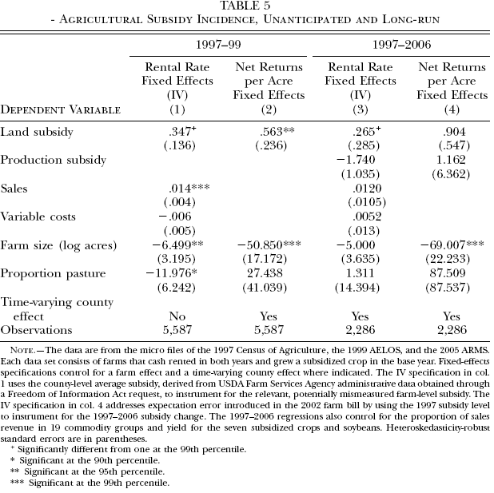

```{r setup, include=FALSE}
knitr::opts_chunk$set(echo=FALSE, fig.pos='htbp', fig.align = 'center', warning = FALSE, message = FALSE,  dev="CairoPDF", out.width = '75%')

#Load some packages
if (!require("pacman")) install.packages("pacman")
pacman::p_load(magrittr)
pacman::p_load(tidyverse)
pacman::p_load(viridis)
pacman::p_load(Cairo)
pacman::p_load(readxl)
pacman::p_load(lubridate)
pacman::p_load(scales)
pacman::p_load(stargazer)

#Basic setup for figures
source("Figures/Graph parameters.r")

```

\setcounter{chapter}{5}
\setcounter{page}{140}

# Supply effects of government interventions in agriculture

Commodity programs have supported US farmers through price support, crop insurance, lump-sum transfers and in many other ways. Depending on how these commodity programs are designed, they affect markets in different ways.

We will look at the impact of government support to agriculture in three sections. First we will take a look at the incidence of commodity program on farmland rental rates. Second, we will look at the supply effects of a US dairy program. Finally, we will look at farm support programs that are specifically designed not to affect production. We will see the reasons why in fact those programs affect production and how to obtain estimate the effect on production of these programs.

## US agricultural subsidies and farmland rental rate: Kirwan (2009)

Recall that many agricultural economists claim that most of the value of subsidy to agriculture is captured by land [remember for example @Gardner1992]. However, this claim was made on the basis that the elasticity of supply for land is near zero. In the previous section, we saw that even though the supply of land equals zero, other inputs capture a share of the subsidy unless strong assumptions hold regarding the elasticity of supply of other inputs or the elasticity of substitution equals zero. We calculated in the previous section that land captures about 39 cents of one dollar subsidy expenditure under reasonable assumptions for the elasticities.

Estimating the incidence of agricultural subsidy on land is a difficult task. @Kirwan2009 provides evidence of the effect of subsidy on farmland rental rate. @Kirwan2009 uses three quasi-experiments from policy changes to identify farmland rental rate response to changes in subsidy rate. The first is the 1996 Federal Agricultural Improvement and Reform (FAIR) Act that altered the relative subsidy rate among crops. Prior to the FAIR Act, the subsidy rate was a function of commodity's price after harvest. Under the FAIR Act, the subsidy is no longer a function of price and is known in the spring when rental rates are set. The FAIR Act also phased out agricultural subsidies over a 7-year period. The second experiment are emergency legislations in 1998 and 1999 implemented in response to decline in agricultural prices. These policies increased the subsidy rates. Finally, the 2002 Farm Security and Rural Investment (FSRI) Act provides a last set of policy changes. The FSRI Act divided agriculture subsidy in a component related to price after harvest and a component unrelated to price. FSRI Act increased subsidy compared to the FAIR Act. Most of the results are based on the first quasi-experiment.

The subsidy to a farm $i$ for a crop $k$ in year $t$ can be calculated as $$\text{subsidy}_{ikt} = \delta_{kt} \overline{y}_{ik1985} b_{ikt} s_{kt},$$
where $\delta_{kt}$ is scaling factor, $\overline{y}_{ik1985}$ is a farm-specific program yield equal to the average production yield for crop $k$ on farm $i$ between 1980 and 1984, $b_{ikt}$ are base acres that qualify for subsidy and $s_{kt}$ is the national subsidy rate. The subsidy is paid to the farm operator (tenant), not the landlord, although the subsidy is attached to land.

The main source of data to analyze the effect of the FAIR Act is the US Census of Agriculture for 1992 and 1997. @Kirwan2009 limits the analysis to farms that report paying cash rent in both 1992 and 1997. Because of the change in policy, @Kirwan2009 worries of the endogeneity problem in the farms that choose to use cash rent payments under the two policies. A Heckman selection model shows that endogeneity is not an issue. @Kirwan2009 creates the per-acre rental rate by dividing total cash rent by total acres rented. This measure tends to underestimate rental rate for farms that cash rent a part of their land and sharecrop the rest. The subsidy rate is measured as the difference between total payments from government and payments from the Conservation Reserve Program (CRP). Other variables are sales revenue per acre, variable production expenditures per acre, log of farm size, proportion of acres irrigated, proportion of acres in pastures, proportion of sales in 19 commodity categories and yields of the subsidized crops and soybeans.

### Estimation strategy and results

@Kirwan2009 controls for unobserved productivity factors using farm and time-varying county fixed effects. The estimating equation is
\begin{equation}
r_{ijt} = \alpha + g_{it}^\star \gamma + X'_{it} \beta + f_i + C_{jt} + \epsilon_{ijt}, \label{eq.Kirwan2}
\end{equation}
where $r_{ijt}$ is the average rental rate for farm $i$ in county $j$ in year $t$. The variable $g_{it}^\star$ is the expected per-acre subsidy by the farm operator in the spring, $f_i$ is the farm fixed effect and $C_{jt}$ is a time varying county effect. The vector $X'_{it}$ includes other observable covariates. @Kirwan2009 estimates the model in first-difference.

For $t=1997$ the subsidy per acre is known when rental contracts are signed. However, for $t=1992$ the subsidy is not known when cash rent payments are set, which causes an attenuation bias. @Kirwan2009 strategy is to use 1997 subsidy level as an instrument for the expectation error.

Table \ref{tab.Kirwan1} shows the regression results. Column 4 includes the fixed effects and instruments the expected per-acre subsidy for 1992. The implication is that landlords capture at the margin 21 cents out of one dollar of subsidy.

```{r, echo=FALSE, fig.cap = "Agricultural subsidy incidence (Table 2 in Kirwan, 2009)\\label{tab.Kirwan1}", out.width = '75%'}

```

If the supply of variable inputs is perfectly elastic, this means that the remaining 79 cents of subsidy should accrue to the tenant. To verify this, @Kirwan2009 estimate the model in \eqref{eq.Kirwan2} replacing the dependant variable by the per-acre net returns, calculated as the total revenue less variable costs divided by total farmland acres. Column 5 in table \ref{tab.Kirwan1} shows that on average 80 cents of a dollar of marginal subsidy is captured as revenue by the tenant. Accounting for renters owning about a third of the land they farm, this means that tenants receive about 70 cents of the marginal subsidy dollar on rented land. Thus, landlord and tenant account almost for the whole dollar of marginal subsidy, with a 25/75 landlord/tenant subsidy split.

### Further evidence

@Kirwan2009 further investigates the incidence of subsidies using the emergency legislation of 1999 as a quasi-experiment. The data come from the 1999 Agricultural Economics and Land Ownership Survey (AELOS). This approach provides an estimate of incidence from an unanticipated shock. Column 1 and 2 of table \ref{tab.Kirwan2} show that the results are not too different from those in table \ref{tab.Kirwan1}. The landlord captures 0.34 cent of one dollar of subsidy, a larger share than in the previous estimation. About 56 cents of a marginal subsidy dollar accrues to the tenant.

```{r, echo=FALSE, fig.cap = "Agricultural subsidy incidence, unanticipated and long-run (Table 5 in Kirwan, 2009)\\label{tab.Kirwan2}", out.width = '75%'}

```

Another robustness check by @Kirwan2009 is to verify that the same results hold for the long-run. For this last set of estimations, @Kirwan2009 uses the FSRI Act as a quasi-experiment. The data come from the 1997 Census of Agriculture and the 2006 Agricultural Resource Management Survey (ARMS). Columns 3 and 4 of table \ref{tab.Kirwan1} report results similar to the results in table \ref{tab.Kirwan1}

### Conclusion

@Kirwan2009 conjecture that tenants capture most of the subsidy because land rental markets are imperfectly competitive. As evidence, @Kirwan2009 shows increase concentration in tenants. That increase in concentration appears to affect the incidence of subsidy as it reduces the share of subsidy captured by landlords.

@Kirwan2009 finds that farmers who rent land capture about 75\% of the subsidy while land rental rate captures the remainder, 25\%. This is far from what economists had thought for a long time that land captures most of agriculture subsidy.

@KirwanRoberts2016 use field-level data instead of farm-level data to estimate the incidence of subsidies on farmland rental rate. One problem with farm-level data is that subsidies and land quality on rented land may differ from owner land. That correlation may introduce a bias when using farm-level data may introduce a bias in the estimated incidence. Indeed, @KirwanRoberts2016 find that landlords capture between 20 and 28 cents of a dollar of subsidy using field-level data while the incidence is between 42 and 49 cents when using farm-level data. The incidence of the subsidy on rental rate diminishes with respect of the size of the operated acres and the duration of the agreement.


## Cross-subsidization due to inframarginal support in agriculture: de Gorter, Just and Kropp (2008)

We will look in this sections one paper that estimates the effects of commodity programs by estimating a cost function and then simulating the effect of a policy on entry and exit.

Cross-subsidization refers to sales at a high price to a group of customers that subsidizes sales to another group of customers at a lower price. In a dispute between Canada and the United States and New-Zealand, the World Trade Organization ruled that the domestic support program to Canada dairy illegally subsidized exports because of cross-subsidization. @deGorter2008 show that cross-subsidization occurs because of *exit deterrence* and *extramarginal output*. The authors show that cross-subsidization is driven by declining average cost.

Figure \ref{fig.crosssubs} shows figure 1 in @deGorter2008. $T$ is the target price price, $B$ is the output for which the target price applies and $Q^{\ast}$ is the ``natural" level of output. The output of a firm is determined by the intersection of the marginal cost and the price. The price schedule is $T$ for $Q<B$ and $p$ for $Q>B$. Thus, some firms with a low marginal cost will produce at $Q^{\ast}$. Other with a higher marginal cost will only produce with the inframarginal subsidy: some produce at $Q^{\ast}<B$ and other produce at $B$. @deGorter2008 compare two types of policy for the management of the price support program.

```{r, echo=FALSE, fig.cap = "Economics of cross-subsidization: exit deterrence and extramarginal output (figure 1 in de Gorter et al., 2008)\\label{fig.crosssubs}", out.width = '75%'}
knitr::include_graphics("Figures/crosssubs.png")
```


### Restrictive policy

Under a restrictive policy, a firm must produce $Q^{\ast}<B$ to receive the subsidy. Firms may however opt out and produce  $Q^{\ast}$. The profit of a firm is given by
$$\Pi(Q) = \left\{
        \begin{array}{ll}
          PQ - C(Q) - FC  &\text{ if } Q>B\\
          TQ - C(Q) - FC &\text{ if } 0<Q<B\\
          -FC &\text{ if } Q=0
        \end{array}
      \right.,$$
where $FC$ is the fixed cost. The subsidy may reduce production of firms who would produce without the subsidy. However, the subsidy may deter exit and increase production if $T>ATC_B$, where $ATC_B$ is the average total cost evaluated at $Q=B$. See figure \ref{fig.crosssubs}.

### Unrestrictive policy

An unrestrictive policy does not put a constraint on the production of firms that receive the subsidy. The profit of a firm is therefore given by
$$\Pi(Q) = \left\{
        \begin{array}{ll}
          P(Q-B) + TB - C(Q) - FC  &\text{ for } Q>B\\
          TQ - C(Q) - FC &\text{ for } 0<Q<B\\
          -FC &\text{ for } Q=0
        \end{array}
      \right..$$
Note that it is always the case that profit maximization yields $p=\p C(Q)/\p Q$ provided that $Q^{\ast}>B$.

Looking at figure \ref{fig.crosssubs}, we see that a firm produces $Q^{\ast}$ if $a>b+c$ and if $T>ATC_B$. However, a firm chooses to produce $B$ if $a<b+c$ and if $T>ATC_B$.

For $T<ATC_B$, a firm is out of business if restricted to produce at $B$. However, if $T<ATC_B$ but $a>b+c$ it may be the case that $\Pi(Q^{\ast})>0$. This is a case of cross-subsidization.

Note that inframarginal subsidy can be as distorting as an equivalent output subsidy. Depends on cost structure and distribution of firm size.

### Application to dairy industry

@deGorter2008 apply their theory to US dairy data. The authors estimate a cost function using data from the USDA-ARMS for five regions. Farms are classified into three categories:

1. Production point at which payment becomes inframarginal for a number of cows corresponding to 2.5 million of pounds of production, given the average yield per cow in that region (varies by region).
2. Point at which payment becomes inframarginal to 299 milking cows.
3. 300 and more milking cows.

The authors estimate the following cost function: $$\frac{TC}{farm_{ij}}=a_{1ij}q_{ij} + a_{2i}q_{ij}^2+FC_{ij},$$ where $TC/farm_{ij}$ is the total cost per farm, $i$ is the size group and $j$ is the region. The coefficient $a_{2i}$ does not vary by region because of identification problem.

Given that the payment structure is known and the estimated cost function, the authors can obtain through simulations the number of farms that are only in production because of subsidy. The authors report in table 2 that

- Inframarginal subsidy increases production by 5.9\%.
- Increase the number of farms by 4.2\% in the short-run.
- In the long run, production increases by less (4.4\%) but the number of farm increases by more (5.6\%).

Figure \ref{tab.crosssubs} shows the results for cross-subsidization.

```{r, echo=FALSE, fig.cap = "Effect of cross-subsidization on production and number of farms in the long run: table 3 in de Gorter et al., 2008\\label{tab.crosssubs}", out.width = '75%'}

```


## Decoupling

Under the Uruguay Round Agreement of agriculture, countries member of the World Trade Organization (WTO) agreed to reduce export subsidies, improve access to their markets and reduce domestic support to agriculture. In particular, countries committed in the Uruguay Round Agreement to reduce subsidies that distort production. That is, WTO members agreed to modify the structure of agriculture support toward less production distorting subsidies. This is often referred to has decoupling payments from production and prices.

The WTO classifies subsidies into boxes depending on how production distorting a subsidy is. These boxes and the restriction that WTO members agreed to are:

- **Amber box:** Policies that directly affect production (e.g. price support). Countries are allowed a maximum of 5\% of the Aggregate Measure of Support (AMS) to enter the Amber box (*de minimis* - over total agricultural production).
- **Blue box:** Program payments that are based on fixed acreage and yield, fixed number of head of livestock or if they are designed on 85\% or less of base production. These policies are seen as acceptable but it is difficult to tell whether a subsidy program fits into this category and whether programs in the blue box affect production.
- **Green box:** Policies that have little or no effect on production (research programs, domestic food aid, environmental programs, certain crop insurance and income-support programs).

### Equilibrium displacement model of decoupled payments: appendix in Sumner(2005)

@Sumner2005 presents a simple equilibrium model of the effects of agricultural subsidies on production. The equations of the model are:
\begin{align*}
\text{Demand: } Q=f(P),\\
\text{Supply: } Q=h(R),
\end{align*}
where $P$ is the price paid by consumers and $R$ is the effective price received by producers. $R$ includes the market price and government subsidy $G$ such that $$R=P + G = P + \gamma g,$$ where $\gamma$ is the degree to which government revenue provides a production subsidy and $g$ is the per unit government support. If $\gamma=1$, this means that the subsidy is directly tied to production while if $\gamma=0$ the subsidy does not affect production.

Total differentiation of the demand equation yields $$dQ = \frac{\p f}{\p P} dP \Rightarrow EQ = \eta EP.$$ Total differentiation of the supply equation yields $$ dQ = \frac{\p h}{\p R} dR = \frac{\p h}{\p R} (dP + dG) = \frac{\p h}{\p R} (dP + d\gamma g + \gamma dg).$$ Dividing by $Q$ on both sides, we can write
\begin{align*}
EQ =& \epsilon \left( \frac{P}{R} \frac{dP}{P} + \frac{G}{R} (E\gamma + Eg) \right)\\
   =& \epsilon \left( \alpha EP + (1-\alpha) (E\gamma + Eg) \right).
\end{align*}
We can solve the displacement expressions for the demand and the supply and find that
\begin{align*}
EP =& \frac{\epsilon (1-\alpha) (E\gamma + Eg)}{\eta-\alpha \epsilon},\\
EQ =& \frac{\eta \epsilon (1-\alpha) (E\gamma + Eg)}{\eta-\alpha \epsilon}.
\end{align*}

Keeping the level of the subsidy constant, we can calculate the effect of increasing the coupling of the subsidy
\begin{align*}
\frac{EP}{E \gamma} =& \frac{\epsilon(1-\alpha) }{\eta-\alpha \epsilon}<0,\\
\frac{EQ}{E \gamma} =& \frac{\epsilon\eta (1-\alpha)}{\eta-\alpha \epsilon}>0.
\end{align*}
Likewise, the effect of increasing the amount of subsidy, keeping coupling constant we find
\begin{align*}
\frac{EP}{E g} =& \frac{\epsilon(1-\alpha) }{\eta-\alpha \epsilon}<0,\\
\frac{EQ}{E g} =& \frac{\epsilon \eta (1-\alpha)}{\eta-\alpha \epsilon}>0.
\end{align*}
That is, reducing the coupling of the subsidy or the total government subsidy has the same effect on production and price.

Table 5.3 in @alston2010 shows calculations for $\gamma$ for program crops. $TS_1$ is the total subsidy and $TS_2$ is a weighted sum that represents an estimate of the equivalent rate of output subsidy per dollar of payment. @alston2010 calculates $TS_2$ assuming that one dollar of direct payment is equivalent to 40 cents of subsidy on output ($\gamma_{dp} = 0.40$), that one dollar of counter-cyclical payment is equivalent to 50 cents of a subsidy on output($\gamma_{cc} = 0.50$) and that one dollar of loan deficiency payment or one dollar of marketing loan gain is equivalent to one dollar of subsidy on output ($\gamma_{LGP} = \gamma_{ML} = 1$). For all program crops, coupling on production is $$ \gamma = \frac{TS_1}{TS_2} = \frac{\$10,958M}{\$16,522M} = 0.66.$$ That is, the total of subsidy expenditure in agriculture was as distorting as two third of the expenditure given as direct subsidy on production.

### Are decoupled payments really decoupled: Goodwin and Mishra (2005-2006)

In the 1996 FAIR Act (farm bill), market price support and deficiency payments were replaced by fixed payments (called production flexibility contract or ``Agricultural Market Transition Act" (AMTA) payments) and loan deficiency payments. AMTA payments were based on historical production and considered decoupled. These payments were calculated by multiplying the farm's payment yield, 85\% of farm's contract acreage (1996) and the production flexibility contract payment rate.

AMTA payments are considered ``green-box." But, are these payments really decoupled? For instance, payments increase wealth which may:

- Cause farmers with decreasing absolute risk aversion preference are willing to accept more risk [@hennessy1998];
- Cover fixed cost and prevent producers from exiting;
- Have a psychological (behavioral) effect that make farmers want to stay in agriculture.

@Goodwin2006 investigate empirically the effects of AMTA on acreage.

The model of @Goodwin2006 yields the following reduced-form acreage response equation: $$ A_t = f(A_{t-1}, P_t^\ast, w_t, G_t, PS_t^\ast,W_{t-1}),$$ where $P_t^\ast$ is the expected output price, $w_t$ is the input price, $G_t$ are decoupled payments, $PS_t^\ast$ are payments based on market conditions and $W_{t-1}$ is wealth.

@Goodwin2006 use individual farm data from the Agricultural Resource Management Survey (ARMS) between 1998 and 2001. These data are combined with county data from USDA-NASS (National Agricultural Statistics Service). There are some problems with the individual farm data:

- Farms are randomly selected each year. Thus, cannot use fixed effect and must rely on cross-sectional variability;
- Farm receiving high AMTA payments had a large base;
- Current payments correlated with current acreage;
- Bias results up?

The solution proposed by @Goodwin2006 later in the analysis is to treat each county as a farm. This allows for a time series of data.

The first part of the econometric analysis uses farm-level data. The authors sample data using population weighting factors to account for the stratification of the data. The authors perform 2000 replications estimating the model each time with a pseudo-sample of data drawn with replacement.

@Goodwin2006 estimate their model in three segments.

1. Farm-level acreage analysis for corn, soybeans and wheat. Table 2 in @Goodwin2006 shows the results of the estimation. The direct effects of AMTA payments is positive for all crops but significant only for corn and soybeans. The estimates in table 2 in @Goodwin2006 imply direct elasticities (not including interaction terms) of acreage with respect to AMTA of 0.0317 for corn, 0.0204 for soybeans and 0.0428 for wheat. The overall elasticities (including interaction terms) of acreage to AMTA payments are 0.0344 for corn, 0.0246 for soybeans and 0.0333 for wheat. Thus, the effect of AMTA payments is positive but small. Also, crop acreage is more responsive than the total scale of a farm.
2. The analysis of idled acreage refers to land where no crop is planted. Farmers may decide to leave land idle to let it ``rest" after several years of intense farming or to benefit from governmental programs. If AMTA payments affect acreage, the data should reveal that less land is left idling. @Goodwin2006 use two measures of idled land:

    - $1-\frac{\text{Total harvested acres}}{\text{Total farm acres}}$, i.e. the share of land that is not harvested;
    - ARMS survey data (not cropped)
    
    Under these specifications, if the coefficient for AMTA is negative, it means that more intensive use of land. Results are in table 3. @Goodwin2006 find that for the two specifications that the AMTA elasticities are -0.31 and -0.22. Thus, there is a significant effect of AMTA in reducing idling.

3. Land acquisition. In this specification, @Goodwin2006 estimate a probit of the decision to purchase land. Results are in table 4. The direct effect of AMTA payments is positive but not significant. However, the overall effect is negative because of the interaction term with insurance.

The previous analysis relies on cross-sectional variation. Aggregating farms at the county level allows the authors to construct time series. ARMS data are not included in this analysis because they are too sparse to derives meaningful aggregates or averages. With county level data, that allows the construction of a time-series, @Goodwin2006 find again a small effect of AMTA payment on acreage. However, that effect is only significant for soybeans. The AMTA elasticity for soybean is 0.018. @Goodwin2006 mention that the elasticities for corn and wheat are smaller than 0.01.

@Goodwin2005, in an extension of @Goodwin2006, find very similar results. From a nationwide survey of farms, @Goodwin2005 find that 21\% of farmers identify direct payments as an important factor in the acreage decisions. About two third of farmers report using the direct payment on farm.

@Goodwin2005 also estimate an acreage response model using data for 2002 and 2003. The base acreage was updated in 2002 based in the 1998-2001 yield and production. However, the 1998-2001 acreage is conditional on the base under the previous program. @Goodwin2005 find that the effect of direct payment is not statistically significant but that base acreage under FAIR is significant.

