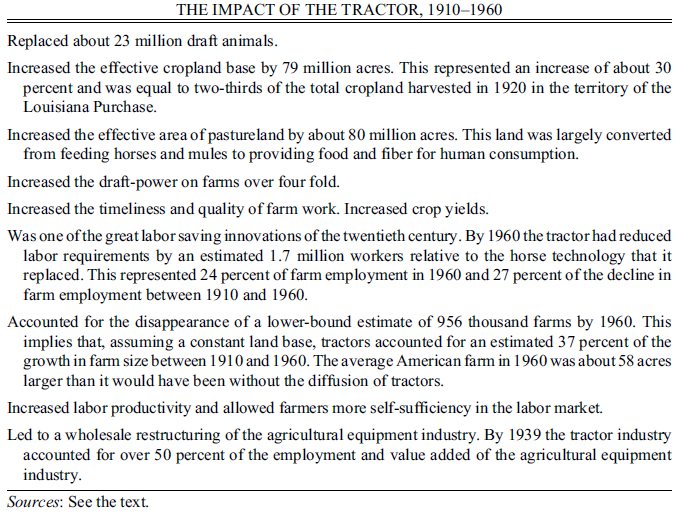
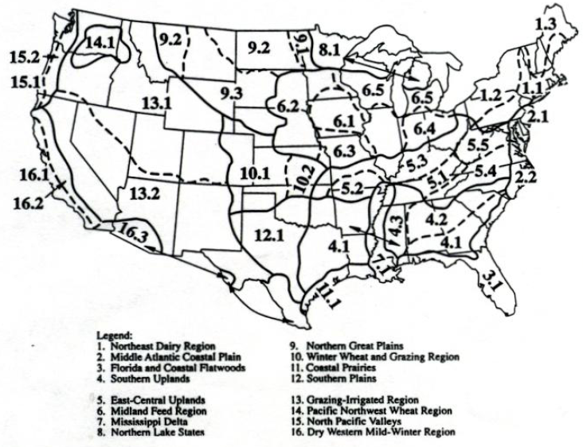
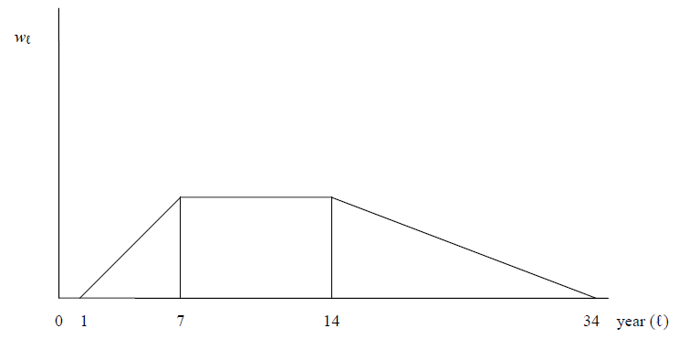

```{r setup, include=FALSE}
knitr::opts_chunk$set(echo=FALSE, fig.pos='htbp', fig.align = 'center', warning = FALSE, message = FALSE,  dev="CairoPDF", out.width = '75%')

#Load some packages
if (!require("pacman")) install.packages("pacman")
pacman::p_load(magrittr)
pacman::p_load(tidyverse)
pacman::p_load(viridis)
pacman::p_load(Cairo)
pacman::p_load(readxl)
pacman::p_load(lubridate)
pacman::p_load(scales)
pacman::p_load(stargazer)

#Basic setup for figures
source("Figures/Graph parameters.r")

```

\setcounter{chapter}{6}
\setcounter{page}{152}


# Research benefits and technology adoption in agriculture^[I base these notes on what I learned from Julian Alston while I was a graduate student at UCDavis. I recommend reading @Alston2018, where he summarizes the main issues in the economiocs of R\&D in agriculture.]

In 1798, Thomas Malthus wrote

> I think I may fairly make two postulata. First, that food is necessary to the existence of man. Secondly, that the passion between the sexes is necessary and will remain nearly in its present state. These two laws, ever since we have had any knowledge of mankind, appear to have been fixed laws of our nature, and, as we have not hitherto seen any alteration in them, we have no right to conclude that they will ever cease to be what they now are, without an immediate act of power in that Being who first arranged the system of the universe, and for the advantage of his creatures, still executes, according to fixed laws, all its various operations.

>...

>Assuming then my postulata as granted, I say, that the power of population is indefinitely greater than the power in the earth to produce subsistence for man. Population, when unchecked, increases in a geometrical ratio.

Simply put, Malthus wrote that population naturally tends to grow but that the earth can only provide a limited amount of resources. This implies that as population grows over several generations and outpace agricultural productivity, human may revert back to subsistence-level conditions. See @Clark2007a for a description of the Malthusian trap.

The prediction of Malthus, made more than 200 years ago, has not yet materialized because of research in agriculture to increase productivity. Outstanding growth in agriculture in most countries of the world has greatly contributed to increase standard of living and move resources from agriculture to other sectors of the economy. However, recent estimates show a slow down in agriculture productivity growth [e.g. @Alston2009]. @Wang2015, in contrast, does not find a slow in agricultural productivity growth.

In this chapter we will focus on the economics of research and technology adoption in agriculture. In particular, we will see the role of government in agriculture research and the determinants of technology adoption. Consequences of technical changes in agriculture include

- Declining real food costs;
- Declining farm numbers;
- Greater farm size;
- More mechanized and specialized production systems;
- Less labor in agriculture;
- More product homogeneity.

Some regard new technology in agriculture as the most useful way to reduce poverty and malnutrition in developing countries. Other value traditional farming methods and resist new technologies in agriculture.

Agricultural research shapes the agricultural landscape and is a very important strand of the literature in agricultural economics. See for example @Alston1995, @Huffman2006 or @Alston2010a for their important contributions.

## The role of government in agricultural R\&D

An argument for the role of government in agricultural research and development (R\&D) is that there is a market failure in agricultural R\&D that causes the private sector underinvests in agricultural R\&D from society's point of view. Why?

- Many small producers and increasing return to scale and scope in research;
- Poor property rights:
    - Spillover, free-riding;
    - Private sector invests in appropriable technologies (that can benefit the developer of a technology).
- Private sector discounts is higher than social discount and research benefits are realized only after many years;
 - Society less risk averse than private sector.

Market failure in agricultural research is more likely to arise in research related to farming (many small producers) and in research with a wide range of applications (basic, fundamental research).

Some empirical studies find an average rate of return to government R\&D in agriculture: 30-50\%.^[Let's accept this rate of return for now. We will see later how this is calculated and whether that is comparable to rates of return for private projects.] This is above return on most investment by private firms. Why is it so high and is such a rate of return credible?

- Biased up: overstate benefits and understate cost, still high rate of return;
- Rate of return higher for basic (fundamental) R\&D;
- Rate of return higher for R\&D on crops than R\&D for livestock production;
- Rate of return higher for public sector R\&D than for private sector R\&D;
- Correlation between private and public R\&D investments causing to overstate the contribution of public expenditure in R\&D;
- Incorrect aggregation.

The government conducts research in sectors where there is no competition from the private sector. Thus, of course you should expect the rate of return to be quite high.

Government R\&D includes research undertaken in universities and governmental agencies like the USDA. However, the government can achieve the same result as conducting research by implementing other policies. The government alternatives to conduct research in agriculture include

- Subsidize private sector R\&D;
- Allow for institutional arrangements (check-offs).

Choice of policy has implications on equity and efficiency.

The benefits and costs of R\&D is a dynamic process.^[See @Evenson2001 for a review of the methods to estimate the rate of return to research in agriculture.] Figure \ref{fig.RandD} an example of what the timeline of costs and benefits of R\&D looks like. Costs are incurred over many years early on and benefits are observed only many years after the beginning of a research project. @Griliches1958, in a seminal paper, describes the s-shape of the benefits of R\&D in the adoption process using a logit function. Figure \ref{fig.RandD} shows the importance of discount rate in evaluating the value of research in agriculture.

\begin{figure}[htbp]
\begin{center}
    \begin{picture}(310,200)
        %Axises and labels
        \scriptsize
        \put(0,80){\vector(1,0){310}} %x-axis
        \put(0,0){\vector(0,1){180}} %y-axis
        \put(-55,170){\$/year}
        %Lines
        \thicklines
        %Costs
        \qbezier(0,40)(20,35)(35,30)
        \qbezier(35,30)(60,20)(80,50)
        \qbezier(80,50)(90,70)(160,80)
        %Benefits
        \qbezier(60,80)(80,80)(110,135)
        \qbezier(110,135)(125,160)(190,150)
        \qbezier(190,150)(240,140)(300,80)
        %Year labels
        \put(310,75){year}
        \put(300,80){\line(0,-1){3}}
        \put(295,65){30}
        \put(250,80){\line(0,-1){3}}
        \put(245,65){25}
        \put(200,80){\line(0,-1){3}}
        \put(195,65){20}
        \put(150,80){\line(0,-1){3}}
        \put(145,65){15}
        \put(100,80){\line(0,-1){3}}
        \put(95,65){10}
        \put(50,80){\line(0,-1){3}}
        \put(50,65){5}
        %Labels
        \put(20,55){Research costs}
        \put(145,110){Research benefits}
    \end{picture}
\vspace{0.1in}
\caption{Timeline of costs and benefits of R\&D} \label{fig.RandD}
\end{center}
\end{figure}

Note that not all research projects are successful and many will yield no benefits. In some cases, even though research is successful, the technology may never be implemented. Research is a risky business as the net return of a research project may very well be negative.

We can measure the return to research using two methods. The *Net Present Value* of investing in agriculture research is: $$ NPV_t=\sum_{k=0}^\infty \frac{B_{t+k} - C_{t+k}}{(1+r)^k},$$ where $B_{t+k}$ is the benefit of research at time $t+k$, $C_{t+k}$ is the cost of research at time $t+k$ and $r$ is the applicable interest rate. That method gives the total benefit (or loss) of a research in dollars at time $t$ accounting for future costs and benefits. Any project that yields a positive net present value is worth undertaking. However, the net present value does not allow a convenient ranking of research project as it compares only the benefits without considering the cost (scale) of investment to undertake the project. One difficult question to answer is what is the relevant discount rate that should be used?

The second method finds the *Internal Rate of Return* (IRR) that yields a total net benefit equal to zero $$\sum_{k=0}^\infty \frac{B_{t+k} - C_{t+k}}{(1+IRR)^k} =0.$$ A project is worth undertaking if $IRR>r$. The IRR correctly ranks project in terms of their profitability but says nothing regarding the size of the investment of the value of the benefits to society. The IRR also assumes that it is possible to reinvest benefits at a rate of return equal to $IRR$.

A combination of NPV and IRR can be used to rank project. Typically, NPV is used *ex ante* to set priorities and the IRR is used *ex post* in evaluation studies.

## Who benefits from R\&D?

As in the case of subsidy to agriculture, the benefits of research in agriculture are distributed along the supply chain following the elasticities of demand and supply. Let us begin by considering a simple partial equilibrium framework in a closed economy. We will abstract and ignore input suppliers for now. See @Alston1995 for more detail on this model.

### Beneficiaries of R\&D in a single market under perfect competition

Let's first consider the case where R\&D causes a parallel shift in the supply of a commodity. Figure \ref{fig.ben_parallel} illustrates the effect of R\&D on the market equilibrium. Research benefits consumers:$$ \Delta CS = P_0 a b P_1 >0,$$ and benefit producers as well: $$\Delta PS =  P_1 b e_1 - P_0 a e_0  = P_1 b c d = P_0 a b c d - P_0 a b P_1 >0.$$ The total benefit to the economy is given by $$\Delta TS = e_0 a b e_1 = P_0 a b c d >0.$$

\begin{figure}[htbp]
\begin{center}
    \begin{picture}(240,240)
        %Axises and labels
        \scriptsize
        \put(0,0){\vector(1,0){220}} %x-axis
        \put(0,0){\vector(0,1){220}} %y-axis
        \put(215,-10){Q}
        \put(-5,210){\makebox(0,0){P}}
        %Lines
        \thicklines
        \put(0,200){\line(1,-1){180}}%Demand
        \put(0,60){\line(1,1){140}}%Supply
        \thinlines
        \multiput(70,130)(0,-10){13}{\line(0,-1){6}}%Dashed line - vertical
        \multiput(70,130)(-10,0){7}{\line(-1,0){6}}%Dashed line - horizontal
        %Text
        \put(185,20){$D$}
        \put(65,-7.5){$Q_0$}
        \put(-10,130){$P_0$}
        \put(145,200){$S_0$}
        %Introduce subsidy
        \thinlines
        \put(130,190){\vector(0,-1){40}}
        %Shift in the supply
        \color{blue}
        \multiput(90,110)(0,-10){11}{\line(0,-1){6}}%Dashed line - vertical
        \multiput(90,110)(-10,0){9}{\line(-1,0){6}}%Dashed line - horizontal
        \multiput(70,90)(-10,0){7}{\line(-1,0){6}}%Dashed line - horizontal
        \thicklines
        \put(0,20){\line(1,1){180}}%Supply-2
        \put(85,-7.5){$Q_1$}
        \put(-10,110){$P_1$}
        \put(185,200){$S_1$}
        %Surfaces
        \color{black}
        \put(67,135){$a$}
        \put(90,115){$b$}
        \put(73,87){$c$}
        \put(-10,90){$d$}
        \put(-10,60){$e_0$}
        \put(-10,20){$e_1$}
        \end{picture}
\vspace{0.1in}
\caption{Benefits of research considering a parallel shift in the supply curve} \label{fig.ben_parallel}
\end{center}
\end{figure}

The consequences on the economy are different when considering that research makes the supply more elastic. Consider the rotation in the supply curve in figure \ref{fig.ben_rotation}. The effect on consumers is given by $$ \Delta CS = P_0 a b P_1 >0.$$ The rotation in the supply curve cause the surplus of producers to change by $$\Delta PS =  P_1 b e -P_0 a e= e a b - P_0 a b P_1 = e f b - P_0 a f P_1 \frac{>}{<} 0.$$ That is, producers do not always benefit from research. The total benefit to the economy is however always positive $$\Delta TS = e a b>0.$$ Overall, when the supply becomes more elastic, consumers get a greater share of the benefits (and conversely). In the case of a rotation in the supply curve, producers may loose when the demand is inelastic.

\begin{figure}[htbp]
\begin{center}
    \begin{picture}(240,240)
        %Axises and labels
        \scriptsize
        \put(0,0){\vector(1,0){220}} %x-axis
        \put(0,0){\vector(0,1){220}} %y-axis
        \put(215,-10){Q}
        \put(-5,210){\makebox(0,0){P}}
        %Lines
        \thicklines
        \put(0,200){\line(1,-1){180}}%Demand
        \put(0,60){\line(1,1){140}}%Supply
        \thinlines
        \multiput(70,130)(0,-10){13}{\line(0,-1){6}}%Dashed line - vertical
        \multiput(70,130)(-10,0){7}{\line(-1,0){6}}%Dashed line - horizontal
        %Text
        \put(185,20){$D$}
        \put(65,-7.5){$Q_0$}
        \put(-10,130){$P_0$}
        \put(145,200){$S_0$}
        %Introduce subsidy
        \thinlines
        \put(130,190){\vector(0,-1){65}}
        %Shift in the supply
        \color{blue}
        \multiput(93.333,106.666)(0,-10){11}{\line(0,-1){6}}%Dashed line - vertical
        \multiput(93.333,106.666)(-10,0){9}{\line(-1,0){6}}%Dashed line - horizontal
        \multiput(70,95)(-10,0){7}{\line(-1,0){6}}%Dashed line - horizontal
        \thicklines
        \put(0,60){\line(2,1){180}}%Supply-2
        \put(85,-7.5){$Q_1$}
        \put(-10,106.6666){$P_1$}
        \put(185,150){$S_1$}
        %Surfaces
        \color{black}
        \put(67,135){$a$}
        \put(90,115){$b$}
        \put(73,87){$c$}
        \put(-10,95){$d$}
        \put(-10,60){$e$}
        \put(45,110){$f$}
        \end{picture}
\vspace{0.1in}
\caption{Benefits of research considering a rotation in the supply curve} \label{fig.ben_rotation}
\end{center}
\end{figure}

### Beneficiaries of R\&D in vertical markets

We saw in the section on welfare how surplus is distributed in a supply chain following elasticities of demand and supply. In the case of the benefits of research, the idea is the same. The beneficiaries of research are not only those that directly benefits from the innovations but all the agents in the supply chain able to capture a share of the surplus. We will see that the distribution of benefits depends on

- Elasticities;
- Nature of technological change (biased toward one input?);

Consider here a non-neutral technological change. Most technological changes are non-neutral because often the objective of research is to reduce the quantity of labor (e.g. harvesting machinery). A good example is the square tomatoes in California and the mechanization of tomato harvest (<http://daviswiki.org/square_tomato>). @Huffman2010 provides a good review of labor-saving harvest technologies in fruits and vegetables.

Figure \ref{fig.RDnonneutral} shows an example of isoquants for a non-neutral technological change that is $X_2$-saving. That is the case where the marginal product of $X_1$ increases.

\begin{figure}[htbp]
\begin{center}
    \begin{picture}(240,240)
        %Axises and labels
        \scriptsize
        \put(0,0){\vector(1,0){220}} %x-axis
        \put(0,0){\vector(0,1){220}} %y-axis
        \put(215,-10){$x_1$} %Horizontal axis label
        \put(-15,210){$x_2$} %Vertical axis label
        %Lines
        \thicklines
        \qbezier(50, 200)(78, 78)(200, 50)
        \put(205,50){$q^0$}
        \color{blue}
        \qbezier(30, 150)(70, 70)(200, 50)
        \color{black}
        \put(70,146){\vector(-1,-1){22}}
    \end{picture}
\vspace{0.1in}
\caption{Non-neutral technological change} \label{fig.RDnonneutral}
\end{center}
\end{figure}


Figure \ref{fig.Incnonneutral} shows the incidence of a non-neutral technological change in a supply chain. Note that the figure assumes that the supply of the output does not shift. In reality, however, there is a shift out of supply curve of the output because the rotation of the iso-quant causes the firm to use more of the less costly input. You can see this from the shift up in the demand for input one and the shift down in the demand for input. Saving on the cost of the more expensive input is the objective of the non-neutral technological change  Thus, of course, the suppliers of input 1 are better off and the suppliers of input 2 are worst off.

\begin{figure}[htbp]
\vspace{0.2in}
\begin{center}
    \subfloat[Farm output]{
    \centering
    \begin{picture}(200,220)
    %%%%%%%%% Output %%%%%%%%%%%%%%
        %Axises and labels
        \scriptsize
        \put(0,20){\vector(1,0){200}} %x-axis
        \put(0,20){\vector(0,1){200}} %y-axis
        \put(195,10){Q}
        \put(-10,215){P}
        %Lines
        \thicklines
        \put(0,200){\line(1,-1){160}}%Demand
        \put(0,40){\line(4,5){120}}%Supply
        \multiput(71.111,128.888)(-10.16,0){7}{\line(-1,0){5.08}}%Dashed line - horizontal
        \multiput(71.111,128.888)(0,-10.89){10}{\line(0,-1){5.44}}
        \put(160,30){$D$}
        \put(120,195){$S^0$}
        %Comment
        \put(100,120){Small shift in supply}
    \end{picture}
    \label{fig.food_RD}
    }
    \\
    \vspace{0.3in}
    \subfloat[Input 1]{
    \centering
    \begin{picture}(180,200)
    %%%%%%%%% Input 1 %%%%%%%%%%%%%%
        %Axises and labels
        \scriptsize
        \put(0,20){\vector(1,0){175}} %x-axis
        \put(0,20){\vector(0,1){175}} %y-axis
        \put(175,7.5){$x_1$}
        \put(-5,195){\makebox(0,0){$w_1$}}
        %Lines
        \thicklines
        \put(0,160){\line(1,-1){120}}%Demand
        \put(0,45){\line(1,1){135}}%Supply
        \multiput(57.5,102.5)(-9.58,0){6}{\line(-1,0){4.79}}%Dashed line - horizontal
        \multiput(57.5,102.5)(0,-10.30){8}{\line(0,-1){5.15}}
        \put(120,30){$D_1^0$}
        \put(135,185){$S_1$}
        \color{blue}
        \put(0,180){\line(1,-1){140}}%Demand
        \multiput(67.5,112.5)(-9.64,0){7}{\line(-1,0){4.82}}%Dashed line - horizontal
        \multiput(67.5,112.5)(0,-10.28){9}{\line(0,-1){5.14}}
        \put(140,30){$D_1^1$}
        \put(25,135){\vector(0,1){20}}
    \end{picture}
    \label{fig.input2_RD}
    }
    \hspace{0.15in}
    \subfloat[Input 2]{
    \centering
    \begin{picture}(180,200)
    %%%%%%%%% Input 2 %%%%%%%%%%%%%%
        %Axises and labels
        \scriptsize
        \put(0,20){\vector(1,0){175}} %x-axis
        \put(0,20){\vector(0,1){175}} %y-axis
        \put(175,10){$x_2$}
        \put(-5,195){\makebox(0,0){$w_2$}}
        %Lines
        \thicklines
        \put(0,180){\line(1,-1){140}}%Demand
        \put(0,70){\line(2,1){150}}%Supply
        \multiput(73.33,106.67)(-10.48,0){7}{\line(-1,0){5.24}}%Dashed line - horizontal
        \multiput(73.33,106.67)(0,-9.63){9}{\line(0,-1){4.815}}
        \put(140,30){$D_2^0$}
        \put(155,145){$S_2$}
        \color{blue}
        \put(0,160){\line(1,-1){120}}%Demand
        \multiput(60,100)(-10,0){6}{\line(-1,0){5}}%Dashed line - horizontal
        \multiput(60,100)(0,-10){8}{\line(0,-1){5}}
        \put(120,30){$D_2^1$}
        \put(25,155){\vector(0,-1){20}}
    \end{picture}
    \label{fig.input2_RD}
    }
\end{center}
\caption{Incidence of non-neutral technological on supply chain} \label{fig.Incnonneutral}
\end{figure}

### Beneficiaries of R\&D in horizontal markets (spillover)

In many cases, research undertaken in one country affects production in other countries as well. For instance, new corn seeds developed to perform well in the US mid-west may perform as well, or even better in other parts of the world. In such case, it is possible that the developer of the new technology (the United States in this case) does not benefit from the technology because of the technological spillover.

Figure \ref{fig.spillover} shows an example of when a new technology development spills over to another country. Before technological change, country A is an importer and country B is an exporter. The technology is developed for country A and therefore results in a shift in the supply to the right in country A. However, the new technology also applies to country B where the supply also shifts to the right. The world price is determined by the intersection of the world demand and the world supply. The world supply shifts to the right and the price goes down. In figure \ref{fig.spillover}, country A remains an importer and country B remains an exporter. Overall, the new technology benefits to consumers in both countries but producers do not necessarily benefit. Whether producers in country A or country B benefit depends on the size of the shifts in the supply in country A and the size of the shift in supply in country B.

\begin{figure}[htbp]
\vspace{0.2in}
\begin{center}
    \subfloat[Country A]{
    \centering
    \begin{picture}(150,150)
        %Axises and labels
        \scriptsize
        \put(0,20){\vector(1,0){125}} %x-axis
        \put(0,20){\vector(0,1){125}} %y-axis
        \put(120,7.5){$Q_A$}
        \put(-10,140){P}
        %Lines
        \thicklines
        \put(0,140){\line(1,-1){100}}%Demand
        \put(0,70){\line(1,1){70}}%Supply
        \thinlines
        \multiput(0,100)(10,0){12}{\line(1,0){5}}%Dashed line - horizontal
        \color{blue}
        \thicklines
        \put(0,60){\line(1,1){80}}%Supply
        \thinlines
        \multiput(0,93.75)(10,0){12}{\line(1,0){5}}%Dashed line - horizontal
        \put(20,90){\vector(0,-1){10}}
    \end{picture}
    \label{fig.cA}
    }
    \subfloat[Country B]{
    \centering
    \begin{picture}(150,150)
        %Axises and labels
        \scriptsize
        \put(0,20){\vector(1,0){125}} %x-axis
        \put(0,20){\vector(0,1){125}} %y-axis
        \put(120,10){$Q_B$}
        \put(-10,140){P}
        %Lines
        \thicklines
        \put(0,140){\line(1,-1){100}}%Demand
        \put(0,50){\line(1,1){90}}%Supply
        \thinlines
        \multiput(0,100)(10,0){12}{\line(1,0){5}}%Dashed line - horizontal
        \color{blue}
        \thicklines
        \put(0,35){\line(1,1){90}}%Supply
        \thinlines
        \multiput(0,93.75)(10,0){12}{\line(1,0){5}}%Dashed line - horizontal
        \put(20,70){\vector(0,-1){15}}
    \end{picture}
    \label{fig.cB}
    }
    \subfloat[World]{
    \centering
    \begin{picture}(150,150)
        %Axises and labels
        \scriptsize
        \put(0,20){\vector(1,0){140}} %x-axis
        \put(0,20){\vector(0,1){125}} %y-axis
        \put(135,10){$Q_W$}
        \put(-10,140){P}
        %Lines
        \thicklines
        \put(0,140){\line(2,-1){130}}%Demand
        \put(0,50){\line(1,1){20}}%Supply
        \put(20,70){\line(2,1){110}}%Supply
        \thinlines
        \multiput(0,100)(10,0){14}{\line(1,0){5}}%Dashed line - horizontal
        \color{blue}
        \thicklines
        \put(0,35){\line(1,1){25}}%Supply
        \put(25,60){\line(2,1){105}}%Supply
        \thinlines
        \multiput(0,93.75)(10,0){14}{\line(1,0){5}}%Dashed line - horizontal
        \put(40,80){\vector(0,-1){12.5}}
    \end{picture}
    \label{fig.W}
    }
\end{center}
\caption{Spillover of technology developed in country A into country B} \label{fig.spillover}
\end{figure}

Spillovers change the incentives for firms to conduct R\&D. Patents may not apply in every countries. Should government increase intellectual property rights? The issue of intellectual property rights and spillover is examined in @Lence2008.

One example of spillover is the adoption of CIMMYT (International Maize and Wheat Improvement Center - <http://www.cimmyt.org/>) dwarf wheat in Australia. CIMMYT developed the new variety of wheat with the intention of increasing yields in developing countries, which it did. However, the adoption of CIMMYT wheat in Australia and the resulting increased yields caused an increase in the exports of wheat by Australia which caused a decrease in the world price of wheat [@Brennan2007].

### Beneficiaries of R\&D when market distortions are present

We consider above the distribution of research benefits in markets with no inefficiencies (e.g. costless transactions and perfect competition). In practice, distortions affect the distribution of research benefits:

- Taxation, subsidies - what price to use to calculate benefits?
- Externalities and environmental regulations;
- Market power (see for example @Alston1997 for the effect of market power by the middleman).
- Trade restrictions (See for example @Lapan2004 for trade restrictions of the imports of genetically modified products and @Carter2007 for an event study of the Starlink corn event);
- Interest groups opposing to the adoption of new technologies (e.g. biotechnology).

In @Moschini1997, the market distortion comes from the innovator having monopoly power in selling an innovative product.

Conventional analysis assumes that inventions are given away. This is however only true for some government research. More and more research is performed by profit seeking private firms. Innovations are protected by Intellectual Property Rights (IPRs) and the innovator acquires monopoly power in the innovation. Thus, monopoly power by the innovator affects the size and the distribution of research benefits. The model of @Moschini1997 applies to inputs in agriculture such as seeds where a firm can protect its patent. The inventor sells the new variety of seed (think of Monsanto or Pioneer).

The issue of IPRs in agriculture is controversial. Should companies have property right over genes? One important case was Percy Schmeiser vs. Monsanto in Canada. In 2000, Monsanto sued Schmeiser for patent infringement for roundup ready canola (some say it comes from CANadian Oil Low Acid - a type of rapeseed) developed by Monsanto. Schmeiser had for years used his own seed. In 1998, he noticed that a part of his production was resistant to Roundup, an herbicide made by Monsanto. So, Schmeiser kept the seeds from resistant canola to plant in the following year. Schmeiser's canola had become resistant through pollination from roundup ready canola from nearby fields. Monsanto noticed that Schmeiser's canola was resistant to canola and sued him for patent infringement. Monsanto ended-up winning the case in 2004 in a decision of Canada Supreme Court. Even though Percy Schmeiser lost in court, he made quite a bit of money by giving talks all around the world about the case.

@Moschini1997 consider that technology innovation augments the contribution of an input into the production of a good. Let the old technology (before the innovation) be given by $$ y = f(x_0,z),$$ where $y$ is the output, $x_0$ is the input and $z$ is all other inputs. The new technology (after the innovation) is given by $$y = g(x_1,z),$$ where $x_1$ is the innovated input.

Three ways to relate the new technology to the old technology, without changing the functional form of the production function:

i. $g(x_1,z) = f(\alpha x_1,z)$ where $\alpha>1$;
ii. $g(x_1,z) = f(\alpha x_1, \gamma z)$ where $\alpha, \gamma$ is such that $f(\alpha x, \gamma z)>f(x,z)$ for all $(x,z)$;
iii. $g(x_1,z) = \alpha f( x_1,z)$ where $\alpha>1$.

In 1), the innovation affects only the first input and this is how @Moschini1997 model innovation. In 2), it is general factor augmentation and in 3) a Hicks-neutral innovation.

Given that @Moschini1997 model innovation following 1), the authors write that $f(\hat{x},z) = f(\alpha x, z)$, where $\hat{x}$ is the input of interest in terms of efficiency units. @Moschini1997 anchor the measure of efficiency before the innovation takes place such that $\hat{x_0} \equiv x_0$ and a similar equality holds for the price of the input $\hat{w_0} \equiv w_0$. After the innovation, given that the input is measure in terms of units before the innovation, we can write that $\hat{x_1} \equiv \alpha x_1$ and $\hat{w_1} \equiv w_1/\alpha$.

Let the profit function of a firm be given by $$\pi(p,\hat{w},r) \equiv \max_{\hat{x},z} \{ p f(\hat{x},z) - \hat{w} \hat{x} - r z \},$$ where $p$ is the price of the output and $r$ is the price of the other input. Using Hotelling's lemma we find the output supply
$$y^\ast = \pi_p(p,\hat{w},r)= \left\{
        \begin{array}{ll}
          y(p,w_0,r)  &\text{ if old technology,}\\
          y(p,w_1/\alpha, r) &\text{ if new technology.}
        \end{array}
      \right.
$$
Likewise, the input demand is
$$
\hat{x}^\ast = - \pi_{\hat{w}}(p,\hat{w},r)= \left\{
        \begin{array}{ll}
          x(p,w_0,r)  &\text{ if old technology,}\\
          (1/\alpha) x(p,w_1/\alpha, r) &\text{ if new technology.}
        \end{array}
      \right.
$$
The quantity demanded of output at equilibrium is given by $$D(p^\ast) = y(p^\ast, \hat{w}, r),$$ where $p^\ast$ is the equilibrium price.

The authors assume that both $x_0$ and $x_1$ are produced at a constant marginal cost $c$. The profit of a firm producing the innovated input is $$(w_1 - c) x_1 = \left( \hat{w}_1 - \frac{c}{\alpha} \right)\hat{x}_1.$$ Let the derived demand for the innovated input in efficiency unit be $$\chi(\hat{w}) = x(p(\hat{w},r),\hat{w},r).$$ Thus, the price that maximizes the profit of the monopolist supplier of the innovated input is given by $$ \hat{w}_1^m \equiv \operatorname*{arg\,max}_{\hat{w}_1} \{\left( \hat{w}_1 - \frac{c}{\alpha} \right) \chi(\hat{w}_1) \}.$$

@Moschini1997 distinguish between two types of innovation defined by the capacity of the innovator of charging the monopoly price:

- *Drastic innovation*: Innovator can charge the monopoly price;
- *Nondrastic innovation*: Adoption constraint is binding: $\hat{w}_0 \ge \hat{w}_1^m$. That is, the price per effective unit of the new technology cannot be greater than the price per effective unit than the old technology.

Below, we compare welfare for drastic and nondrastic innovations under perfect competition and monopolization of the input market. I will only discuss of who gains from the innovation. Welfare comparison with preexisting monopoly is more complicated because of profit comparison. Total profit by input suppliers may fall for small innovations because it makes the market more competitive.

#### Welfare changes for nondrastic innovation

Figure \ref{fig.MoschiniLapan_3} shows the input market for a nondrastic innovation (figure 3 in @Moschini1997). What makes the innovation nondrastic is that the innovator cannot charge the monopoly price. Under perfect competition in the input market, the price of input before the innovation equals $c$. The innovator maximizes its profit with respect to $\hat{x}_1$  by equating its marginal cost $c/\alpha$ to the marginal revenue curve $MR$. However, at the quantity $\hat{x}_1^\ast$ is above $c$, constraining the innovator selling price.

Lets consider that the market for the input before the innovation is either perfectly competitive or monopolized.

i. Perfect competition:
    - $c/\alpha=MR$ at  $\hat{x}_1^\ast$ in figure \ref{fig.MoschiniLapan_3} and the monopolist charges a price $\hat{w}_1^\ast = c - \epsilon$, where $\epsilon$ is very small;
    - All benefits go to the innovator as buyers purchase the same quantity at the same price in terms of effective units.

ii. Preexisting monopoly:
    - The initial price is above the $c$ at $\hat{w}_0$ in figure \ref{fig.MoschiniLapan_3};
    - After the innovation, the monopolist charges a price $\hat{w}_1^\ast = c - \epsilon$;
    - Thus, the effective price is lower after the innovation;
    - Gain to farmers and gain to the innovator.

```{r, echo=FALSE, fig.cap = "Nondrastic innovation - the input market (figure 3 in  Moschini and Lapan 1997) \\label{fig.MoschiniLapan_3}", out.width = '75%'}
knitr::include_graphics("Figures/MoschiniLapan_3.png")
```

#### Welfare changes for drastic innovation

Figure \ref{fig.MoschiniLapan_4} shows the input market for a drastic innovation (figure 4 in @Moschini1997). The monopolist is not constrained by input from the old technology and charges a price $\hat{w}_1^m<c$. The innovator there for charge the price on the demand curve for a quantity $\hat{x}_1^\ast$ where $c/\alpha = MR$.

Again, lets take a look at changed in welfare when the market for the input before the innovation is either perfectly competitive or monopolized.

1. Perfect competition:
    - $c/\alpha=MR$ at  $\hat{x}_1^\ast$ in figure \ref{fig.MoschiniLapan_4} and the monopolist charges $\hat{w}_1^m<c$;
    - Farmers pay less per effective unit of input and gain from the innovation;
    - Innovator also gains.
2. Preexisting monopoly:
    - The input price goes down from $\hat{w}_0$ to $\hat{w}_1^m$;
    - Farmers pay less per effective unit of input and gain from the innovation;
    - Innovator also gains.

```{r, echo=FALSE, fig.cap = "Drastic innovation - the input market (figure 4 in Moschini and Lapan 1997) \\label{fig.MoschiniLapan_4}", out.width = '75%'}
knitr::include_graphics("Figures/MoschiniLapan_4.png")
```
#### Comparison with conventional analysis

Conventional analysis tends to overstate the ``true" total benefits because the innovator has market power. In their parametric model, @Moschini1997 show that the error in the calculation of welfare depends crucially on the elasticity of factor substitution: large elasticity of substitution implies larger error for conventional analysis and therefore important implications on the distribution of the welfare gains.

## Technology adoption - the example of tractors in the United States: Olmstead and Rhode (2001)

Tractors have revolutionized modern agriculture by replacing animal power by mechanical power. The consequences to farming were huge. In particular, the introduction of tractors affected farm structure and size and allowed for the allocation of cropland to other use than feeding draft horses. Roughly 22\% of cropland fed draft horses and mules between 1880 and 1920. That is, the introduction of tractors augmented the *effective* farmland by about 20\%. Tractors also increased yields by speeding up plowing and harvest therefore making farm work easier to conduct at time that maximizes yields.

Figure \ref{fig.OlmsteadRhode_1} shows figure 1 in @Olmstead2001. It shows the number of draft animals and tractors in the United States between 1910 and 1960. The number of draft animals peaked in 1918 and then steadily declined. The stock of tractors started growing after World War I, reached a plateau in the 1930s and then steadily grew afterward. @Olmstead2001 note that there was much regional differences in the adoption of tractors. The authors investigate the determinant of tractor adoption in the United States. Notably, how the scale of farms affected the adoption of tractors and how tractors affected the scale of farms.

```{r, echo=FALSE, fig.cap = "Number of draft animals and tractors in the United States (figure 1 in Olmstead and Rhode (2001)) \\label{fig.OlmsteadRhode_1}", out.width = '75%'}
knitr::include_graphics("Figures/OlmsteadRhode_1.png")
```

Figure \ref{fig.tractoradopt} shows a simple model of tractor adoption and draft animal disadoption. Tractors and draft animals are measured in horse power (hp), a unit of power of machinery.^[1 hp equals approximately 735.5 watts.] It is not a perfect measure of input quality but it will do for our purpose. The demand for horse power is the demand by farms. The price of horse power is determined by the intersection of the total supply of horse power (tractors plus draft animals) given by $TS_0$. Let that price include the cost of operating tractors (fuel and maintenance) and operating draft animals (feed and care). At the beginning, the supply of tractors $T_0$ lies above the supply of draft animals $H_0$ because tractors are not well adapted to farming. Over time, tractor technology improved (Ferguson hitch or the 3-point hitch, more reliable tractors) which effectively shifted the supply of tractors to the right to $T_1$. The total supply of horse power shifts to the right to $TS_1$. The immediate effect on draft animals is a small decline in the number of draft animals because the short term supply of draft animals is inelastic. Moreover, the introduction of tractors reduces the price of feeds because the use of tractors frees land therefore shifting the supply of feeds to the right. The reduction in the cost of owning draft animals causes a shift to the right of the supply of draft animals to $H_1$. This effectively slows down the adoption of tractors. Tractors and draft animals are substitute for which prices move in the same direction. In the example in figure \ref{fig.tractoradopt}, the shift to the right of the supply of tractors causes an increase in the work done by tractors and an increase in the quantity of work by horses. However, a more inelastic supply of horses or a smaller shift in the supply of horses would have caused the work done by horses to decrease.

\begin{figure}[htbp]
\begin{center}
    \begin{picture}(310,200)
        %Axises and labels
        \scriptsize
        \put(0,0){\vector(1,0){360}} %x-axis
        \put(0,0){\vector(0,1){180}} %y-axis
        \put(-25,170){\$/HP}
        \put(350,-7.55){HP}
        %Lines
        \thicklines
        %Demand
        \qbezier(80,160)(170,53)(340,20)
        \put(345,20){D}
        %Supplies
        \put(10,50){\line(1,1){120}}
        \put(135,175){$T_0$}
        \put(50,10){\line(1,1){160}}
        \put(210,175){$H_0$}
        \put(150,50){\line(2,1){190}}
        \put(350,150){$TS_0$}
        \thinlines
        \multiput(0,70.5)(10.07,0){19}{\line(1,0){5.03}}%Dashed line - horizontal
        \multiput(30.5,70.5)(0,-10.07){8}{\line(0,-1){5.03}}%Dashed line - vertical
        \multiput(110.5,70.5)(0,-10.07){8}{\line(0,-1){5.03}}%Dashed line - vertical
        \multiput(191,70.5)(0,-10.07){8}{\line(0,-1){5.03}}%Dashed line - vertical
        \color{blue}
        \thicklines
        \put(10,20){\line(1,1){150}}
        \put(165,175){$T_1$}
        \put(70,10){\line(1,1){160}}
        \put(230,175){$H_1$}
        \put(150,25){\line(2,1){190}}
        \put(350,125){$TS_1$}
        \thinlines
        \multiput(0,58.5)(9.82,0){22}{\line(1,0){4.91}}%Dashed line - horizontal
        \multiput(48.5,58.5)(0,-9.75){7}{\line(0,-1){4.88}}%Dashed line - vertical
        \multiput(118.5,58.5)(0,-9.75){7}{\line(0,-1){4.88}}%Dashed line - vertical
        \multiput(216,58.5)(0,-9.75){7}{\line(0,-1){4.88}}%Dashed line - vertical
        \put(30.5,-5){\vector(1,0){18}}
        \put(110.5,-5){\vector(1,0){8}}
        \put(191,-5){\vector(1,0){26}}
    \end{picture}
\vspace{0.1in}
\caption{Tractor adoption and draft animal disadoption} \label{fig.tractoradopt}
\end{center}
\end{figure}

@Olmstead2001 look at factors other than prices that have affected the adoption of tractors. One is whether large or small farms have adopted tractors faster:

- Is the fixed cost of tractors larger than the fixed cost of horses? (horses must be fed even during non-productive periods);
- If the fixed cost of horses is larger than the fixed cost of tractors, then small farms should have adopted tractors more rapidly ;
 - Other factors affecting adoption per farm size are constraints on labor during harvest (timing of farming) that favor adoption of tractors by small farms and access to credit that favors adoption of tractors by larger farms.

In their empirical model, @Olmstead2001 measure diffusion of tractors by the log odds ratio of farms that have adopted tractors and those that have not adopted tractors: $$ Tractor = log\left(\frac{\text{tractor farms}}{\text{non-tractor farms}}\right).$$ The reason for using the log odds ratio is that it is consistent with the share of farms adopting tractors following a logistic distribution [e.g. @Griliches1958]. With a logistic distribution function, the share of farms $s$ that adopt tractors is $$ s=\frac{e^{\mathbf{X'\beta}}}{e^{\mathbf{X'\beta}}+1},$$ where $\mathbf{X}$ is a vector of explanatory variables. Writing the log odds ratio yields $$\frac{s}{1-s}=e^{X'\beta}.$$ Taking the log of the odds ratio thus yield an estimating equation that is linear in parameters. The scale of farms is measure by the log of cropland per farm.

@Olmstead2001 consider simultaneous equations to explain tractor adoption and farm scale as these two variables may be endogenous. Previous work considered that the scale of farms was exogenous to the adoption of tractors. @Olmstead2001 note that some farm may have expanded to make the use of tractors profitable. The empirical model is
\begin{align*}
\text{Scale} ~=~& a_t ~ \text{Tractor} + a_x X_s + a_z Z\\
\text{Tractor} ~ =~& b_s ~ \text{Scale} + b_x X_t + b_z Z,
\end{align*}
where $X_s$ is a vector of instruments that affect scale, $X_t$ is a vector of instruments that affect tractor adoption and $Z$ is a vector of variables that affect both farm scale and tractor adoption. The vector $X_s$ includes the ratio of land rental rate and the wage rate and the date of settlement of the state. The vector $X_t$ includes the ratio of tractor rental rate and the wage rate and the ratio of gasoline price and wage rate.

@Olmstead2001 present their results in table 5. We are interested in the regression for the adoption of tractor, i.e. the equation with the log odds ratio of tractor adoption. The structural equation for tractor adoption (LODDS) show that coefficient for the scale (LCRMFIT) equals 0.7962. This coefficient implies that the increase by 10 percent in farm scale, which is about the rate of increase in farm scale between 1920 and 1960, explains 8\% of the increase in the log ratio. The coefficient for tractor ``rental rate" (LTRWG) and price a fuel (LPGWG) relative to farm wage rates are both negative. Both the price of tractors and the price of fuel have decreased and explain about 22\% of the increase in the log odds ratio between 1920 and 1960. Over that period, the rest, almost 70\% is explained by time... a measure of ignorance.

In addition, @Olmstead2001 explore the effect of factor markets on the diffusion of tractor. I will not discuss this part of the paper here. @Olmstead2001 present a great summary of the impact of tractor between 1920 and 1960 on table 7, reproduced below in figure \ref{tab.tractorsummary}.

```{r, echo=FALSE, fig.cap = "The impact of the tractor, 1910-1960 (table 7 in Olmstead and Rhode 2001)\\label{tab.tractorsummary}", out.width = '75%'}

```
@Olmstead2008 present other results and maps for the adoption of tractors in the United States. The authors also present an economic history of other technologies in the United States.

@ManuelliSeshadri2014 also investigate the adoption of tractors in the United States. Their approach is slightly different in that they include in the relative cost of tractors and horses and their associated labor cost. They conclude that it is with the increase in wages that labor-intensive horses became less profitable to operate then tractors.

## Empirical measures of the benefits of agricultural research

We have briefly discussed the effect of research on agriculture but we have not seen how to measure the impact of public research on agricultural productivity. We cover below how @Huffman2010a measures the impact of public agricultural research on state agricultural productivity. There are many similar studies that how public research affects productivity in agriculture. Recent examples include @Alston2010a and @Plastina2012.

The objective of @Huffman2010a is to explain increased productivity in the United States at the state level. Let $Y=F(X_t, K_t, \mu_t)$ by a state-level aggregated production function, where $Y_t$ be an index of farm outputs at time $t$, $X_t$ is an index of quality-adjusted inputs, $K_t$ is the stock of knowledge and $\mu_t$ represents all other factors. Assume that $F(X_t, K_t, \mu_t)$ is homogenous of degree one with respect to $X_t$ such that we can write that total factor productivity (TFP) is given by
\begin{equation}\label{eq.tfp}
\ln(TFP_t) = \ln(Y/X)_t = G(W(\mathbf{B})R_t,t,\nu_t) = \ln(F(1, K_t, \mu_t)),
\end{equation}
where $G()$ is the productivity function and public agricultural research capital is defined as $$ W(\mathbf{B})R_t = w_0 R_t + w_1 R_{t-1} + w_2 R_{t-2} + w_3 R_{t-3} + ... + w_m R_{t-m},$$ with $R_t$ being the real agricultural research investments and $\sum_{i=0}^m w_{t-i} = 1$. The other variables in \eqref{eq.tfp} are a time trend $t$ and other factors that affect agricultural productivity $\nu_t$. @Huffman2010a writes that a plausible relationship between knowledge capital and research investment is $$K_t = [W(\mathbf{B})R_t]^\eta \exp(\alpha + ct + \nu_t).$$ Thus, we can write \eqref{eq.tfp} as
\begin{equation}\label{eq.tfp2}
\ln(TFP_t) = \alpha + \eta \ln[W(\mathbf{B})R_t] + ct + \nu_t,
\end{equation}
where $\eta$ is the impact elasticity of public agricultural research capital on agricultural productivity and the error term displays first order autocorrelation $\nu_t = \rho \nu_{t-1} + \epsilon_t$.

@Huffman2010a then explains how public agricultural research capital variable is constructed. Public agricultural research capital has a spatial (geo-climatic) component and a time component. Agriculture follows geo-climate according to latitude, altitude, movement of air masses, rain and soil. Thus, research undertaken in one state or by the federal government should impact the most the agricultural research capital in the geo-climate where it is conducted. The border of the geo-climate region do not follow those of states borders. Figure \ref{fig.climate} shows the geo-climatic zones use in @Huffman2010a. These zones are used to build spilling weights by states showed in table 1 of @Huffman2010a. That table shows, for example, that \$1 of research in Iowa spills as \$0.90 of research in Minnesota.

```{r, echo=FALSE, fig.cap = "US agricultural geo-climatic regions and sub-regions (figure 1 in Huffman (2010a) \\label{fig.climate}", out.width = '75%'}

```

Regarding the time component of agricultural research capital, research discoveries do not come in general as a small number of breakthroughs but rather as a continuous stream of advances that impact agriculture. There are also lags between the investment in research and its effect on agriculture. @Huffman2010a discusses four reasons that explain why time is important in dealing with agricultural research investment and agricultural productivity:

1. lags between the investment in efforts by scientists and addition of knowledge;
2. lags between the discovery of new knowledge to the development and marketing of new technologies;
3. lags because it takes time for farmers to adopt new technologies;
4. knowledge depreciates, becomes obsolete.

Overall, a dollar spent on agricultural research today will impact agricultural productivity later and over many years. Thus, the value of research must be distributed over many periods according to weights that account for the moment when research affects productivity. These weights are not left free of form because it would be asking too much from the data. Instead, they are modeled using a function, e.g. a triangular distribution, beta distribution or trapezoid. Figure \ref{fig.timingweights} is an example of how @Huffman2010a constructs agricultural research capital in function of expenditure in agricultural research using a trapezoidal function. @Huffman2010a does not appear to use the same timing as in figure \ref{fig.timingweights}. Instead, @Huffman2010a assumes that for the first two years, research does not impact agricultural productivity. Then, starting in year 3, the weights increase until year 9 and remain constant until year 15. Then the weights decline to zero in year 35 as it is considered that research becomes obsolete.

```{r, echo=FALSE, fig.cap = "Public agricultural research timing weights (figure 2 in Huffman (2010a) \\label{fig.timingweights}", out.width = '75%'}

```

@Huffman2010a uses data collected by the USDA.^[The data are available at <http://www.ers.usda.gov/data-products/agricultural-productivity-in-the-us.aspx>.] From the geo-spatial weights and time weights, @Huffman2010a builds two variables of agricultural research capital for each state: 1) own-state public research capital and 2) state spilling public agricultural research. Some measures of own-state public research capital are shown in figure 3-7 in @Huffman2010a.

From expression \eqref{eq.tfp} the empirical model in @Huffman2010a is
\begin{align*}
\ln(TFP)_{ilt} =& \beta_1 + \beta_2 \ln(\text{RPUB})_{ilt} + \beta_3 \ln(\text{RPUBSPILL})_{ilt} \\
               +& \beta_4 \ln(\text{RPUB})_{ilt} \times \ln(\text{RPUBSPILL})_{ilt} + \tau trend + \sum_l \delta_l D_l + \mu_{ilt},
\end{align*}
where $i$ indicates state, $l$ is the region, $t$ is the year, RPUB is own-state public research capital, RPUBSPILL is the spilling of public agricultural research into state $i$ and region $l$ at time $t$, $trend$ is a trend and $D$ are dummies for regions. The error term is first order autoregressive $\mu_{ilt} = \rho \mu_{ilt-1} + \xi_{ilt}$.

Table 4 in @Huffman2010a shows regression results. These results highlight the importance of research on total factor productivity growth. Notably, the positive sign of the coefficient for the interaction term between own-state public research and spilling research shows that the two types of research are complements.

### An experiment on economic research - application of US agricultural productivity

The *Journal of Productivity Analysis* published an interesting experiment in 2008. As explained in @Stefanou2008, three teams of scholars were asked to answer a common research question: ``What are the policy impacts of research and development on US agricultural productivity patterns?''. The three teams were given the same dataset that was used in @Thirtle2002, augmented with other data, and were free to use whatever technique they see fit. The papers were presented in 2005 at the European Workshop on Efficiency and Productivity Measurement. A few weeks later, an invitation was sent to invite open-peer review of the papers to experts in the field and the authors of the papers were then invited to formally respond to the comments.

The papers from that experiment were published in a special issues to the *Journal of Productivity Analysis* in 2008. The three teams, @Faere2008, @Onofri2008 and @Paris2008, use different techniques to answer the same question, begin their analysis with different assumptions and reach different conclusions. *Journal of Productivity Analysis* also made available comments from experts and the responses by the authors in the same issue of the journal.


