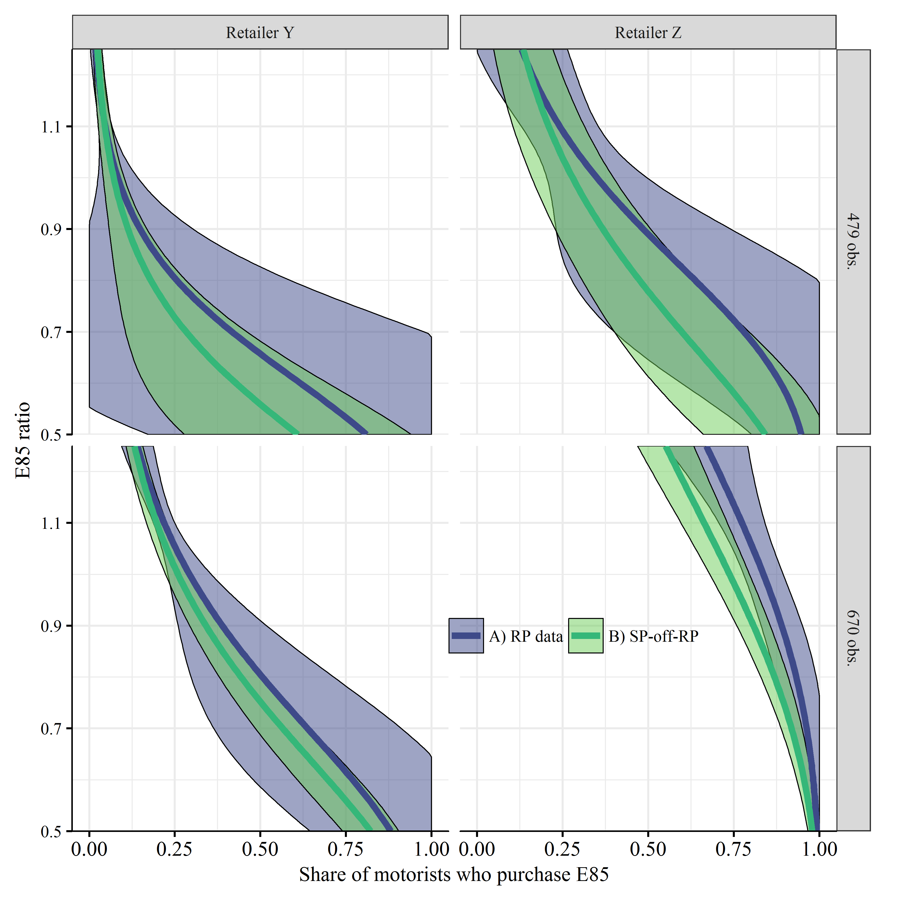

```{r setup, include=FALSE}
knitr::opts_chunk$set(echo=FALSE, fig.pos='htbp', fig.align = 'center', warning = FALSE, message = FALSE,  dev="CairoPDF", out.width = '75%')

#Load some packages
if (!require("pacman")) install.packages("pacman")
pacman::p_load(magrittr)
pacman::p_load(tidyverse)
pacman::p_load(viridis)
pacman::p_load(Cairo)
pacman::p_load(readxl)
pacman::p_load(lubridate)
pacman::p_load(scales)
pacman::p_load(stargazer)

#Basic setup for figures
source("Figures/Graph parameters.r")

```

\setcounter{chapter}{7}
\setcounter{page}{174}


# Consumer's valuation of product attributes

The theory of demand and supply that we have covered in this class considers that goods are homogeneous. Here, we relax this assumption and look into goods that may differ with respect to certain quality attributes. For instance, a car with a 150 hp engine is different than the same car with a 200 hp engine. The type of question we wish to answer is how much are consumers willing to pay on average for that extra 50 hp engine and how much does offering an engine with 50 more hp cost?

Identifying demand shifters from supply shifters is difficult and economists recognized this early [see for example @Working1927]. Going back to the example of a car engine, is it possible to disentangle the cost of a 200 hp engine vs a 150 hp engine from consumers' willingness to pay for a more powerful engine? The material below covers some of the techniques employed by economists to identify consumers' valuation for product attributes where there is no explicit market for these goods. We will focus in particular on the valuation of food attributes such as organic, Genetically Modified Organisms (GMOs) or food safety. The interest in the attributes of food products and the value of those attributes has been a subject of economists for a long time [see for example @Waugh1928].

These notes focus on willingness to pay. The empirical literature identifies an important difference between willingness to pay and willingness to accept especially in cases where the income effect is small. See @Shogren1994 or @Shogren2001 for details. The notes also focus on willingness to pay for attributes for which consumption is exclusive. For example, if a consumer takes a bite in an apple, no one else can consumer that part of the apple. I will not consider willingness to pay for public goods, like amenities in a park. For those goods, estimates of willingness to pay apply to attributes or which consumption is not exclusive and for which there are not always markets, e.g. boat ramp, clean air and clean rivers. Cathy Kling and Joe Herriges, formally at Iowa State University, have done much work on that topic [see for example @Phaneuf1998; @Phaneuf2000].

## Hedonic models using market data

The word hedonic refers to pleasure. In economics, it refers to the pleasure/utility derived by the consumption of a good and its attributes. In hedonic models, economists attempt to estimate consumers' willingness to pay for some product attributes using market data. One application of hedonic models is to correct price indices for changes in product quality.

The hedonic literature goes back to @Houthakker1952, who proposed a framework where quality is introduced as a separate variable in the utility maximization problem. Following this, @Lancaster1966 goes further by considering that consumers do not derive utility from a good itself but from its characteristics. Consumption choices are made such that the goods consumed contain a utility maximizing bundle of characteristics.

We will have a look here at the influential work of @Rosen1974. That work is very often cited but not always correctly.

### The consumption decision

Consider that a good can be described by $n$ attributes or characteristics $\mathbf{z}=(z_1, z_2,...,z_n)$. Each product comes with a vector of characteristics $\mathbf{z}$ and sells at a market price $p(\mathbf{z})$.

The price function $p(\mathbf{z})$ is likely nonlinear as attributes are offered in bundles. @Rosen1974 assumes that arbitrage conditions that can make $p(\mathbf{z})$ linear are not possible. To see this, consider three vectors of characteristics $\mathbf{z_a}$, $\mathbf{z_b}$ and $\mathbf{z_c}$. i) Suppose that $\mathbf{z_a} = (1/t)\mathbf{z_b}$ and that $p(\mathbf{z_a}) < (1/t) p(\mathbf{z_b})$ where $t$ is a scalar and $t>1$. Therefore, $t$ units of $\mathbf{z_a}$ yield the same utility as one unit of $\mathbf{z_b}$ at a smaller cost, ruling out transactions in the convex part of $p(\mathbf{z})$. ii) Now suppose that $\mathbf{z_a}<\mathbf{z_b}<\mathbf{z_c}$ and $p(\mathbf{z_b}) > \delta p(\mathbf{z_a}) + (1-\delta) p(\mathbf{z_c})$, where $0<\delta<1$ and $\mathbf{z_b}=\delta \mathbf{z_a} + (1-\delta)\mathbf{z_c}$. Then characteristics in amount $\mathbf{z_b}$ could be achieved by the purchase of a combination of $\mathbf{z_a}$ and $\mathbf{z_c}$ at a lower cost than purchasing $\mathbf{z_b}$ alone, ruling out products in the concave portion of $p(\mathbf{z})$. @Rosen1974 considers that arbitrage between bundles is not possible. In i), this is equivalent to say that two 6-foot cars are not equivalent to one 12-foot car since the two cars cannot be driven simultaneously. In ii) a 12-foot car for a half year and a 6-foot car for the other half of the year is not the same as a 9-foot car for the whole year.

A consumer maximizes a concave utility function $U(x, \mathbf{z})$ with $x$ being a composite good representing all the other goods consumed. Letting the price of the composite good equal 1, the budget constraint is given by $y=x+p(\mathbf{z})$. The first order conditions for utility maximization require that $\p p(\mathbf{z})/\p z_i = p_i = U_{z_i}/U_x$ for $i=1,...n$.

@Rosen1974 defines a value function $\theta(\mathbf{z}:u,y)$ according to $$ U(y-\theta, \mathbf{z})=u.$$
The value function defines a family of indifference surfaces relating the $z_i$ with money. The amount that the consumer is willing to pay for $\mathbf{z}$ at a fixed utility level is $\theta(\mathbf{z}:u,y)$ while $p(\mathbf{z})$ is the minimum market price that the consumer must pay. Therefore, utility is maximized when $\theta(\mathbf{z^\ast}:u^\ast,y)=p(\mathbf{z^\ast})$ and $\theta_{z_i}(\mathbf{z^\ast}:u^\ast,y)=p_i(\mathbf{z^\ast})$ for $i=1,...,n$ (from the FOC for utility maximization). Thus, utility is maximized when $p(\mathbf{z})$ and $\theta(\mathbf{z}:u,y)$ are tangent.

Figure \ref{fig.Rosen_1} shows the relationship between $p(\mathbf{z})$ and $\theta(\mathbf{z}:u,y)$ in one space for two consumers. Note how it fits with the conditions for utility maximization.

```{r, echo=FALSE, fig.cap = "Relationship between the price and the $\\theta$ for two consumers (figure 1 in  Rosen 1974) \\label{fig.Rosen_1}", out.width = '75%'}
knitr::include_graphics("Figures/Rosen_1.png")
```

### The production decision

Competitive firms make decision on what package of characteristics are profit maximizing for them to supply. Let $M(\mathbf{z})$ be the number of units with a vector of characteristics $\mathbf{z}$ that a firm supplies. Let the total cost of a firm be given by $C(M,\mathbf{z};\beta)$, where $\beta$ reflects variables affecting costs such as factor prices. Each firm maximizes profit $\pi = M p(\mathbf{z}) - C(M,\mathbf{z};\beta)$ with respect to $M$ and $\mathbf{z}$. The first order conditions for profit maximization are
\begin{align*}
p_i(\mathbf{z}) &= \frac{C_{z_i}(M,\mathbf{z};\beta)}{M}, \forall i=1,...,n;\\
p(\mathbf{z}) &= C_{M}(M,\mathbf{z};\beta).
\end{align*}

@Rosen1974 defines an \emph{offer} function $\phi(\mathbf{z}:\pi,\beta)$ that solves
\begin{align*}
\pi &= M \phi - C(M,\mathbf{z};\beta);\\
\phi& = C_{M}(M,\mathbf{z};\beta).
\end{align*}
Maximum profit and optimum set of characteristics satisfy $p_i(\mathbf{z^\ast}) = \phi_{z_i}(\mathbf{z^\ast}:\pi^\ast,\beta)$ and $p(\mathbf{z^\ast}) = \phi(\mathbf{z^\ast}:\pi^\ast,\beta)$. That is, the offer function equals the price and the offer function and the price are tangent. Figure \ref{fig.Rosen_2} illustrates the solution for one characteristic.

```{r, echo=FALSE, fig.cap = "Relationship between the price and the $\\phi$ for two firms (figure 2 in  Rosen 1974) \\label{fig.Rosen_2}", out.width = '75%'}
knitr::include_graphics("Figures/Rosen_2.png")
```


### Empirical strategy
\noindent
In equilibrium, superimposing figure \ref{fig.Rosen_1} and figure \ref{fig.Rosen_2}, the value and the offer functions ``kiss". Thus, the market clearing price function $p(\mathbf{z})$ represents the matching of consumers and firms. The function $p(\mathbf{z})$ is not informative of consumers' valuation or the cost of supplying unless one of the two following special case occurs. A) The function $p(\mathbf{z})$ reveals the cost of supplying product characteristics only when sellers are all identical. B) The function $p(\mathbf{z})$ reveal consumer valuation only when all buyers are identical.

@Rosen1974 proposes a two-stage econometric procedure to identify consumer willingness to pay for products attributes. The first stage requires estimating $p(\mathbf{z})$ in a regression of the products prices as the dependent variable and the products characteristics as the independent variables. Denote the function estimated as $\hat{p}(\mathbf{z})$. The second stage involves computing the implicit marginal prices $\hat{p}_i(\mathbf{z})$ and then, estimating the following functions, ignoring random terms, using the implicit marginal prices as the dependent variable:
\begin{align*}
\text{Demand: }& \hat{p}_i(\mathbf{z}) = F^i(\mathbf{z},\mathbf{Y_1});\\
\text{Supply: }& \hat{p}_i(\mathbf{z}) = G^i(\mathbf{z},\mathbf{Y_2}),
\end{align*}
where $\mathbf{Y_1}$ is a vector of demand shifters and $\mathbf{Y_2}$ is a vector of supply shifters. The function $F^i(\mathbf{z},\mathbf{Y_1})$ is the consumers' marginal willingness to pay and $G^i(\mathbf{z},\mathbf{Y_2})$ is the marginal supply price.

### Problems and solutions from other literature

The seminal work of @Rosen1974 has generated a huge literature and many pitfalls in the empirical strategy proposed by @Rosen1974 have been identified. @Brown1982 note that demand and technology parameters are identified in the framework proposed by @Rosen1974 only through arbitrary functional forms and exclusion assumptions.^[Do not confuse the authors' names. The Rosen in the @Brown1982 article is Harvey Rosen while the Rosen in @Rosen1974 and @Rosen1994 articles is Sherwin Rosen.] @Brown1982 show that, unless some restrictions are applied, the estimates obtained in the second stage are functions of the first stage estimates and that they can be calculated without doing any second stage estimation.

@Brown1982 show that some problems from the empirical approach in @Rosen1974 can be solved by using data from multiple markets. For instance, if data are observed from $r$ different markets than $p(\mathbf{z})$ can be estimated separately for the $r$ markets. The marginal prices $p_i$ would then not only depend upon $\mathbf{z}$ but also on various other factors. Imposing the condition that structural demand and supply parameters are identical across markets even though $p(\mathbf{z})$ is not, parameter identification can then be achieved.

Even the critique of @Rosen1974 by @Brown1982 has come under critique. @Ekeland2002 note that the issue of estimation has been confused with the issue of identification. @Ekeland2004 shows that nonlinearity is a feature of the equilibrium in the hedonic model. Identification in @Ekeland2004 is achieved using semiparametric and instrumental variables estimators from data in a single market.

Other issues include the endogeneity of both prices and quantities. @Bartik1987 and @Epple1987 both overcome the endogeneity problem using instrumental variables. @Bajari2005 relax the assumptions of perfect competition, continuum of products and perfect observability of characteristics and identify demand parameters by imposing structure on consumers' preferences.

### Hedonic models in agriculture

Hedonic models often used to estimate consumers' willingness to pay for product attribute, but rarely from market data that are publicaly available. Most often, survey data are collected. Examples include @Unnevehr1993 who estimate consumers' valuation for fat in beef and @Unnevehr1998 who estimate consumers' valuation for honey attributes such as form, container, brand and floral source. A most common application is to the impact of environmental amenities. For example, @Herriges2005 evaluate the effects of livestock feeding operations on residential sales price.

## Stated preferences - contingent valuation

Data availability is an issue when estimating hedonic models. In particular, finding good instruments that allow for identification of demand parameters might be quite challenging. The analyst may be interested in estimating consumers' willingness for a product attribute that does note exist yet. For example, how much do consumers value a new type of functional food.^[That is, a new ingredients is added to the fabrication of a food product and that ingredient improves the health value of the food product. For example, omega-3 in eggs.] Of course, there is no data available on products that do not exist.

In contingent valuation, people are directly asked about their willingness to pay for an item. The questions are typically asked such that participants can answer by yes or no: consumers are presented different choices in a questionnaire and are asked which of the option they prefer. As these are not real choice, it is referred to as stating preferences rather than revealing preferences as consumers would do in a real market setting.  The approach described in @Rosen1974 is an example of revealed preferences as it uses market data. Contingent valuation studies survey consumers about their characteristics and consumption habits to control for all the factors that affect consumption decisions. Responding to the survey is usually voluntary. In a well-designed contingent valuation survey, subjects are supposed to reveal through their answers their true preferences for product attributes. There is much emphasis to make sure that the study is done such that *incentive compatibility* and *consequentiality* conditions are met. The study must be incentive compatible such that participants do not state preferences strategically. Consequentiality refers to the requirement that participants must feel that there answer will have an impact. If a study is interpreted as a referendum, it should then meet the consequentiality criterion.

Contingent valuation surveys are subject to many critiques. @Kling2012 write a good summary of issues and prospects for the use of contingent valuation. @Carson2012 see good reasons for using contingent valuation but @Hausman2012 is much less enthusiastic. The list below gives some of the shortcomings of contingent valuation.

- Participants do not buy the product and therefore are not placed in a situation where they make a real decision;
- Participants may not fully understand the questions or, in the case where it is a new product attribute, may not understand what the attribute is;
- The person answering the survey may not be the one in the household that shops, even though the survey may instruct that the respondent must be the household member that is responsible for shopping. Surveys also enable the researcher to compare the sample to the population using census data. This comparison is not always meaningful as the person in the household that makes purchases may be different than the average person in the whole population;
- Related to the third critique, respondents to a survey may self select themselves. For example, and I do not have evidence whether this is true, retired people with very low cost of time may be more likely to answer a survey than someone with young kids.
- Results are not always credible.

Although there are many issues with contingent valuation, surveys methods have some advantages.

- Less expensive to perform than other methods;
- Can deal with nonexistent product attributes;
- Can collect a lot of data about consumers;
- May be constructed to facilitate econometric analysis.


After the results of the survey are compiled in a usable format, the analyst can then estimate an econometric model using the data collected in the survey and explain consumer willingness to pay for a product attribute.

## Experiments

One solution to the shortcomings of the methods that we have covered before is to design experiments that recreate the environment where purchases are made. Experiments offer a sterile environment where noise and confounding factors are controlled for. Experiments may also be constructed for products that are not yet available on the market. We will see below two types of experiments that are often conducted and, that even though experiments have some advantages over the two other techniques previously discussed, they also have their own problems.

The discussion about experiment here is quite short. I encourage you to read @Shogren2005 if you are interested in this topic.^[Experiments can be use to test economic theory and understand consumer behaviors, like attitude toward risk. Here I focus only on experiments that are used to find consumers' valuation for some product attributes. The design of experiment to test behavior may be entirely different and the subject to other issues and critiques.]

### Auctions

In an experimental auction for a food product, participants (subjects) are often put together in a room to take part in the auction. The analyst collects data about each participant: age, sex, marital status, income, etc. Then the participants are given an amount of money, say \$20, that they can use during the auction. The participants keep all the money that they have left at the end of the auction. In some experiments, the participants can even leave after receiving money without participating in the auction. The rationale for distributing money to participants is two-fold (and there might be other reasons). First, the money is used as an incentive to find participants. Second, the participants must be put in a context where they are using their own money, recreating the market environment.

The participants may be given at the beginning of the auction a plain product that does not have the characteristic(s) of interest. The participants are then asked to bid to upgrade the product they possess to one that contains the attribute of interest [see for example @Dickinson2002; @Hobbs2005].

The auction is designed such that participants must truthfully reveal their willingness to pay for a product.^[Alternatively, the experiment may be designed to reveal bounds on willingness to pay.] This is done by setting the price paid for the object to a value other than the winning bid such that the participants have all incentives to bid their true valuation (incentive compatibility). One such design is the 2\textsuperscript{nd}-price auction [@Vickrey1961] where the winner of the auction pays a price equal to the second highest bid. The problem of the 2\textsuperscript{nd}-price auction is that off-margin bidders (who think they have no chance of winning the auction) are not engaged in the auction and therefore these bidders may not reveal their willingness to pay for the product. One solution is the n\textsuperscript{th}-price auction where the $n-1$ highest bidders pay the bid price of the n\textsuperscript{th} highest bidder [@Shogren2001]. $n$ is randomly determined after the bids are submitted. See for example @Huffman2007 and @Rousu2007 for examples of n\textsuperscript{th}-price auctions applied to consumer valuation of genetically modified food.

An alternative to the 2\textsuperscript{nd}- or the n\textsuperscript{th}-price auction is the Becker-DeGroot-Marschak mechanism [@Becker1964]. In that type of auction, the selling price is generated randomly and is therefore exogenously determined. If a subject's bid is higher than the price generated, than the participant pays that price and receives the item. If the subject's bid is lower than the randomly generated price, than no transaction occurs.

Many rounds of bidding may be conducted. This allows the subject to learn about the auction process and the bids to stabilize [@Shogren1994; @Hayes1995]. The subjects are informed at the beginning that one round will be randomly drawn and the winning bid from that the round is the one that will be binding. Note that this market-clearing price feedback design endogenizes the price...

Experiment results and then fitted in an econometric model to understand consumer willingness to pay.

### Choice experiments

Choice experiment is another example of a stated preference approach. In a choice experiment, participants are presented several choice sets and are asked to pick one option from each choice set. That is, the subjects observed different pairs of quantities of product attributes and prices and are asked to select the one that is the most desirable. This method has been widely used in marketing and is now becoming more popular in economics. Choice experiments are less invasive and can be completed more quickly and more cheaply than laboratory experiments.

Choices experiments must be well designed to assure the orthogonality of attributes. Before going in to the details, let me first give you what the objective of a choice experiment is. In a choice experiment, a researcher seeks to explain the decision of a subject to choose a set over others. The first step involves modeling the utility of a subject for a given choice set. Let the indirect utility of a participant $i$ be given by $$V_i(\mathbf{X_k})=f_i(\mathbf{X_k},\beta),$$ where the vector $\mathbf{X_k}$ includes the characteristics and the price of product $k$. This corresponds to a choice set. The function $f_i(\mathbf{X_k},\beta)$ is usually linear in parameters. Then the choice of the subject, in a random utility framework, between a set $k$ and a set $l$ is modeled as $$y_{i,kl}=\left\{
        \begin{array}{ll}
          1  \text{ if } V_i(\mathbf{X_k})>V_i(\mathbf{X_l})\\
          0 \text{ otherwise.}
        \end{array}
      \right.$$ That is, a choice experiment involves estimating a multinomial model (logit, probit...).

With market data, the econometrician does his best with the data available. In an experiment, the econometrician has the luxury of collecting the data with the desired properties. So, how should the researcher construct the choice sets and which sets should be presented to each participant? Often, the goal of the researcher is to maximize orthogonality and balance. To understand these concepts, let's have a look at the example in @Lusk2005. Consider orange juice with the attributes of brand (B), price (P) and sweetness (S), each of which is varied at three levels. Perfect orthogonality requires that B, P and S are uncorrelated with one another. Balance requires that each level of each attribute occurs with equal frequency. A design with perfect orthogonality and balance can be obtained by considering a full factorial design. For the case of orange juice, this would involve $3\times3\times3=27$ choice sets. In most cases, a full factorial design is not possible to administer and too costly.

The solution involves considering partial factorial designs where criteria for orthogonality and balance are maximized under constraints such as a maximum number of choice sets. The quality of the design is measured in term of its efficiency by the matrix of information $(\mathbf{X}'\mathbf{X})^{-1}$, where $\mathbf{X}=[B,P,S]$ in the example above. Alternatives to full design include:

- Random;
- Main effects design;
- Main effects plus two-way interaction design;
- Maximum D-efficiency design;
- Full/Bin design.

See @Lusk2005 for details on the choice of experimental design. See @Lusk2004 for an application of choice experiment to beef steaks. Note that some statistical package help you with the design of your experiment (e.g. SAS).

## Hypothetical bias

One of the main critique of contingent valuation, and to some extent of experimental economics especially for finding consumers' valuation, is that it relies on hypothetical settings where real market conditions are not fully replicated.^[@Shogren2005 discusses hypothetical biases in contingent valuation. I include experiments in this section because my personal views are that consumers tend to also exaggerate their willingness to pay in experiments. For instance, I find the findings in @Dickinson2002 and @Hobbs2005 too large.] In general, subjects tend to exaggerate their willingness to pay for product attributes, although this quite unintentional on their part. No definite answer has yet been offered to explain these differences.

Given the consistent exaggeration of valuation from hypothetical settings, some suggest using rules of thumb to obtain values that are closer to what would be observed in the market. For instance, the National Oceanic and Atmospheric Administration's blue-ribbon panel recommended using a ``divide by 2" rule. Some calibration method of survey results involve combining results from the survey to a laboratory experiment [discusses this briefly @Shogren2005].

Other methods to reduce the bias from survey is to use *cheap talk* and framing. Cheap talk simply involves carefully warning respondents about the potential for bias in their responses. Although this technique might reduce the bias, it is however not convincing. Framing recognizes the importance not only of what questions are asked in a survey but also how the questions are asked. For instance, simple change in instructions of information about a product may yield very different survey results.

## Estimating a distribution of preferences for an attribute

The literature described above focuses on point estimates of willingness to pay for a product's attributes. It is not always clear what these point estimates represent. Is it the mean willingness to pay of consumers or is it the mean value paid by consumers who purchased a product with a specific set of attributes? However, for policy analysis or marketing analysis it is more interesting to estimate a distribution of willingness to pay. Indeed, for the sale volumes of a specific attribute at a given price, what matters is the share of consumers who are willing to pay at least that price for the attribute.

Studies that estimate a distribution of willingness to pay for a product attributes are few. @Salvo2013 estimate a distribution of willingness to pay for alcohol as a motor fuel compared to gasoline in Brazil. @PouliotLiaoBabcock2018 estimate distributions of willingness to pay for E85 (which is a gasoline blend that contains about 75 percent ethanol) versus regular gasoline. We will look at how distributions of willingness to pay are estimated in these last two papers.

Write that the utility of a motorist $i$ for fuel $F \in \{e,g\}$, where $e$ is for E85 and $g$ is for regular gasoline, is linear and given by $$V_{iF} = u_F + \alpha_F p_{iF} + \mathbf{x'_i \beta_F} + \epsilon_{iF},$$ where $u_F$ is the utility derived from the consumption of fuel $F$, $p_{iF}$ is the price of fuel $F$ paid by motorist $i$, $\mathbf{x'_i}$ is a vector of characteristics about the motorist and fueling station, and $\epsilon_{iF}$ is a stochastic shifter specific to the motorist that follows a type 1 generalized extreme value distribution.

A motorist chooses E85 if $V_{ie} \ge V_{ig}$. Writing $u \equiv u_e - u_g$, $\alpha = \alpha_e = \alpha_g \le 0$ and $\mathbf{\beta} \equiv \mathbf{\beta_e} - \mathbf{\beta_g}$  and $d_i \equiv p_{ie} - p_{ig}$ (the E85 premium), a motorist chooses E85 if $$u + \alpha d_i + \mathbf{x'_i \beta} + \epsilon_i,$$ where $\epsilon_i \equiv \epsilon_{ig} - \epsilon_{ie}$ follows a logistic distribution. Thus, the probability that motorist $i$ chooses E85 is $Pr(E85)_i = \Lambda(u + \alpha d_i + \mathbf{x'_i \beta})$, and the probability that the motorist chooses E10 is $Pr(E10)_i = 1 - \Lambda(u + \alpha d_i + \mathbf{x'_i \beta})$, where $\Lambda()$ is the cumulative logistic distribution function.

The parameters of the utility function are estimated by maximum likelihood. The log-likelihood function is $$ \ln L = \sum_{i=1}^{N} \left[(1-y_i)\ln\left(1-\Lambda()\right) + y_i \ln\left(\Lambda()\right) \right].$$ Minimizing the log-likelihood yields efficient estimators $\hat{u}$, $\hat{\alpha}$ and $\hat{\mathbf{\beta}}$.

The cumulative of the logistic distribution function is given by $$\Lambda(z;\mu,s)=\frac{1}{1+\exp{\frac{\mu - z}{s}}},$$ where $\mu$ is a location parameter that equals the mean, median and mode of the distribution and $s$ is a scale parameter such that the variance is given by $\frac{s^2 \pi^2}{3}$. To describe the distribution of preferences, we want to write the parameters $\mu$ and $s$ in terms of the estimated parameters $\hat{u}$, $\hat{\alpha}$ and $\hat{\mathbf{\beta}}$ and the data, which we can evaluate at their averages given by $\mathbf{\bar{x}}$. We can write that $\hat{s} = \frac{1}{\hat{\alpha}}$ and that $\hat{\mu} = \frac{\hat{u} + \mathbf{\bar{x}'_i \hat{\beta}}}{\hat{\alpha}}$. Thus, the distribution of preference is given by $$\Lambda(d;\hat{\mu},\hat{s})=\frac{1}{1+\exp{\frac{\hat{\mu} - d}{\hat{s}}}},$$ so that the mean willingness to pay for E85 versus E10 is given by $\hat{\mu}$ and is measure in \$/gal. In @PouliotLiaoBabcock2018, the distribution of preferences for E85 versus E10 is plotted as in Figure \ref{fig.preferences}, for two retailers and two cuts of the data. The shaded areas are 95 percent confidence intervals for two of the models estimated. Figure \ref{fig.preferences} shows that the mean motorist discounts E85 compared to E10 at retailer Y but that large share of consumers at retailer Z value E85 over E10. The distribution of preferences in Figure \ref{fig.preferences} is essentially the demand curve for E85 conditional on the price of E10.

```{r, echo=FALSE, fig.cap = "Probability of E85 purchase as a function of the price ration for E85 and E10 (figure 4 in  Pouliot, Liao and Pouliot (2018) \\label{fig.preferences}", out.width = '75%'}

```

@PouliotLiaoBabcock2018 go into the detail of the identification of motorists preferences. @PouliotLiaoBabcock2018 combines revealed preference (RP) data and stated preference (SP) data which are collected in an hypothetical scenario presented to motorists. The combination of revealed and stated preference data poses a peculiar endogeneity problem because the hypothetical price scenario offered is conditional on the fuel choice made by motorists, hence causing the hypothetical prices offered to be correlated with unobservables that affect motorists fuel choice. @PouliotLiaoBabcock2018 take into account that endegeneity problem using state preference-off-revealed preference.
